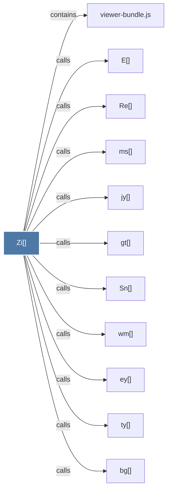

# Zi()

> [!info] Properties
> **File Type**: code
> **Community**: [[_COMMUNITY_Community None|Community None]]
> **Degree**: 11

## Architecture Graph


## Outbound Connections
- [[E()]] - `calls` [EXTRACTED]
- [[Re()]] - `calls` [EXTRACTED]
- [[Sn()]] - `calls` [EXTRACTED]
- [[bg()]] - `calls` [EXTRACTED]
- [[ey()]] - `calls` [EXTRACTED]
- [[gt()]] - `calls` [EXTRACTED]
- [[jy()]] - `calls` [EXTRACTED]
- [[ms()]] - `calls` [EXTRACTED]
- [[ty()]] - `calls` [EXTRACTED]
- [[viewer-bundle.js]] - `contains` [EXTRACTED]
- [[wm()]] - `calls` [EXTRACTED]

## Inbound Dependencies
> [!abstract]- Files that link here
```dataview
LIST
FROM [[Zi()]]
```

#graphify/code #graphify/EXTRACTED #community/Community_None