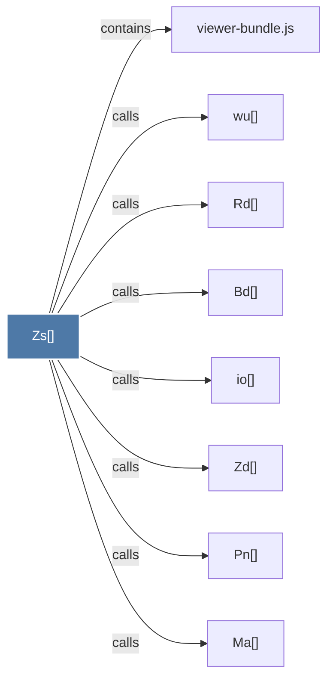

# Zs()

> [!info] Properties
> **File Type**: code
> **Community**: [[_COMMUNITY_Community None|Community None]]
> **Degree**: 8

## Architecture Graph


## Outbound Connections
- [[Bd()]] - `calls` [EXTRACTED]
- [[Ma()]] - `calls` [EXTRACTED]
- [[Pn()]] - `calls` [EXTRACTED]
- [[Rd()]] - `calls` [EXTRACTED]
- [[Zd()]] - `calls` [EXTRACTED]
- [[io()]] - `calls` [EXTRACTED]
- [[viewer-bundle.js]] - `contains` [EXTRACTED]
- [[wu()]] - `calls` [EXTRACTED]

## Inbound Dependencies
> [!abstract]- Files that link here
```dataview
LIST
FROM [[Zs()]]
```

#graphify/code #graphify/EXTRACTED #community/Community_None