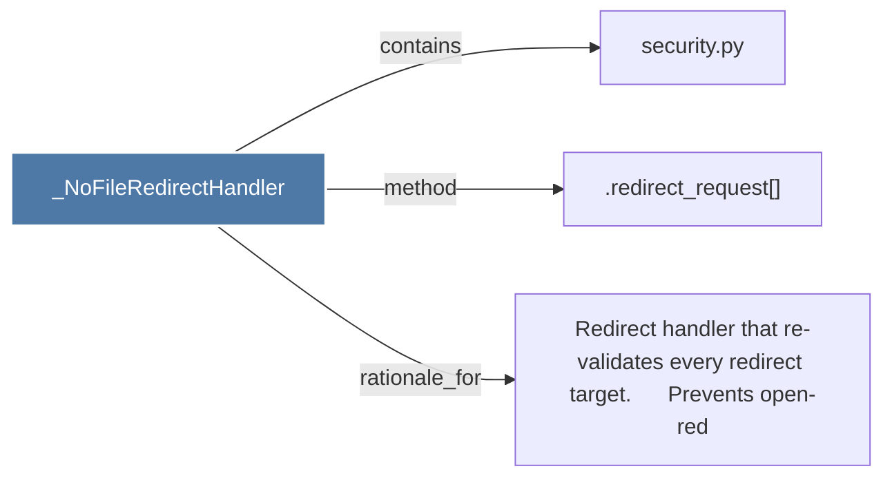

# _NoFileRedirectHandler

> [!info] Properties
> **File Type**: code
> **Community**: [[_COMMUNITY_Community None|Community None]]
> **Degree**: 3

## Architecture Graph


## Outbound Connections
- [[.redirect_request()]] - `method` [EXTRACTED]
- [[Redirect handler that re-validates every redirect target.      Prevents open-red]] - `rationale_for` [EXTRACTED]
- [[security.py]] - `contains` [EXTRACTED]

## Inbound Dependencies
> [!abstract]- Files that link here
```dataview
LIST
FROM [[_NoFileRedirectHandler]]
```

#graphify/code #graphify/EXTRACTED #community/Community_None