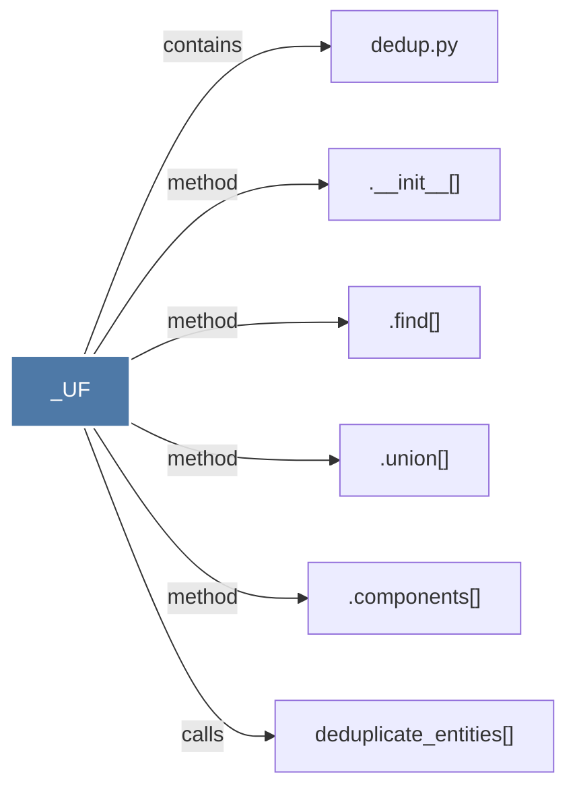

# _UF

> [!info] Properties
> **File Type**: code
> **Community**: [[_COMMUNITY_Community None|Community None]]
> **Degree**: 6

## Architecture Graph


## Outbound Connections
- [[.__init__()_1]] - `method` [EXTRACTED]
- [[.components()]] - `method` [EXTRACTED]
- [[.find()]] - `method` [EXTRACTED]
- [[.union()]] - `method` [EXTRACTED]
- [[dedup.py]] - `contains` [EXTRACTED]
- [[deduplicate_entities()]] - `calls` [EXTRACTED]

## Inbound Dependencies
> [!abstract]- Files that link here
```dataview
LIST
FROM [[_UF]]
```

#graphify/code #graphify/EXTRACTED #community/Community_None