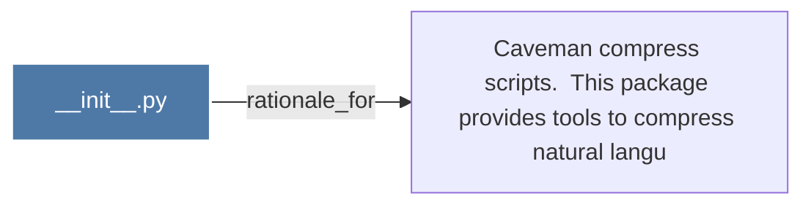

# __init__.py

> [!info] Properties
> **File Type**: code
> **Community**: [[_COMMUNITY_Community None|Community None]]
> **Degree**: 1

## Architecture Graph


## Outbound Connections
- [[Caveman compress scripts.  This package provides tools to compress natural langu]] - `rationale_for` [EXTRACTED]

## Inbound Dependencies
> [!abstract]- Files that link here
```dataview
LIST
FROM [[__init__.py_7]]
```

#graphify/code #graphify/EXTRACTED #community/Community_None