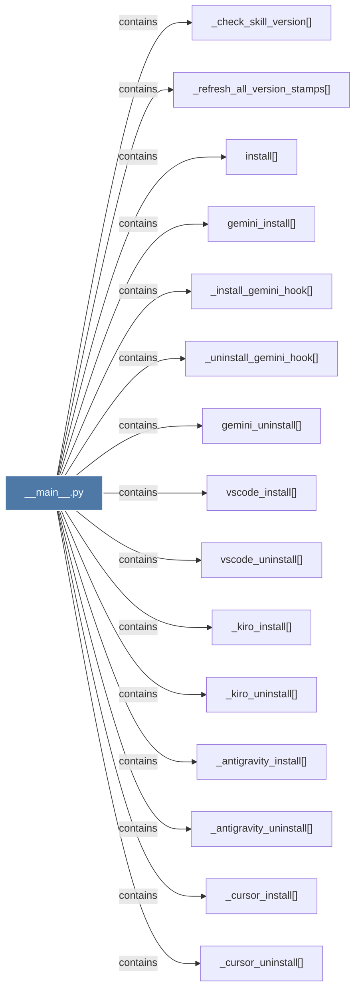

# __main__.py

> [!info] Properties
> **File Type**: code
> **Community**: [[_COMMUNITY_Community None|Community None]]
> **Degree**: 29

## Architecture Graph


## Outbound Connections
- [[_agents_install()_1]] - `contains` [EXTRACTED]
- [[_agents_uninstall()_1]] - `contains` [EXTRACTED]
- [[_antigravity_install()]] - `contains` [EXTRACTED]
- [[_antigravity_uninstall()]] - `contains` [EXTRACTED]
- [[_check_skill_version()]] - `contains` [EXTRACTED]
- [[_clone_repo()]] - `contains` [EXTRACTED]
- [[_cursor_install()]] - `contains` [EXTRACTED]
- [[_cursor_uninstall()]] - `contains` [EXTRACTED]
- [[_install_claude_hook()]] - `contains` [EXTRACTED]
- [[_install_codex_hook()]] - `contains` [EXTRACTED]
- [[_install_gemini_hook()]] - `contains` [EXTRACTED]
- [[_install_opencode_plugin()]] - `contains` [EXTRACTED]
- [[_kiro_install()]] - `contains` [EXTRACTED]
- [[_kiro_uninstall()]] - `contains` [EXTRACTED]
- [[_refresh_all_version_stamps()]] - `contains` [EXTRACTED]
- [[_resolve_graphify_exe()]] - `contains` [EXTRACTED]
- [[_uninstall_claude_hook()]] - `contains` [EXTRACTED]
- [[_uninstall_codex_hook()]] - `contains` [EXTRACTED]
- [[_uninstall_gemini_hook()]] - `contains` [EXTRACTED]
- [[_uninstall_opencode_plugin()]] - `contains` [EXTRACTED]
- [[claude_install()]] - `contains` [EXTRACTED]
- [[claude_uninstall()]] - `contains` [EXTRACTED]
- [[gemini_install()]] - `contains` [EXTRACTED]
- [[gemini_uninstall()]] - `contains` [EXTRACTED]
- [[graphify CLI - `graphify install` sets up the Claude Code skill.]] - `rationale_for` [EXTRACTED]
- [[install()_1]] - `contains` [EXTRACTED]
- [[main()_2]] - `contains` [EXTRACTED]
- [[vscode_install()]] - `contains` [EXTRACTED]
- [[vscode_uninstall()]] - `contains` [EXTRACTED]

## Inbound Dependencies
> [!abstract]- Files that link here
```dataview
LIST
FROM [[__main__.py]]
```

#graphify/code #graphify/EXTRACTED #community/Community_None