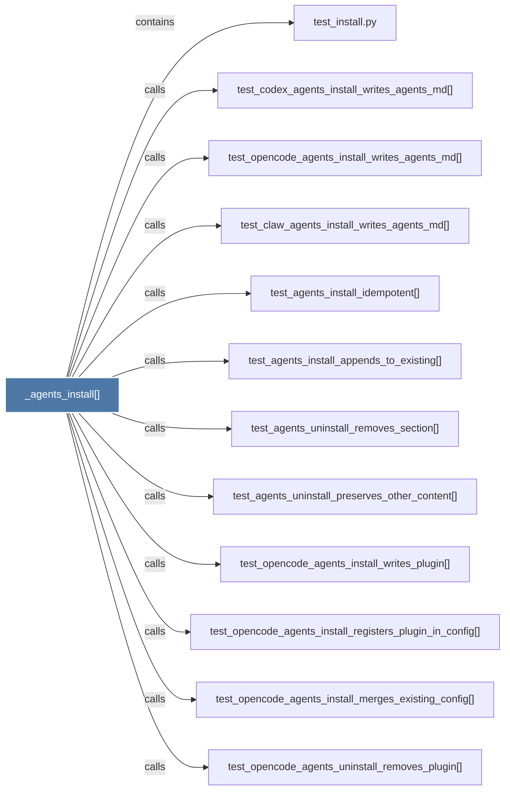

# _agents_install()

> [!info] Properties
> **File Type**: code
> **Community**: [[_COMMUNITY_Community None|Community None]]
> **Degree**: 12

## Architecture Graph


## Outbound Connections
- [[test_agents_install_appends_to_existing()]] - `calls` [EXTRACTED]
- [[test_agents_install_idempotent()]] - `calls` [EXTRACTED]
- [[test_agents_uninstall_preserves_other_content()]] - `calls` [EXTRACTED]
- [[test_agents_uninstall_removes_section()]] - `calls` [EXTRACTED]
- [[test_claw_agents_install_writes_agents_md()]] - `calls` [EXTRACTED]
- [[test_codex_agents_install_writes_agents_md()]] - `calls` [EXTRACTED]
- [[test_install.py]] - `contains` [EXTRACTED]
- [[test_opencode_agents_install_merges_existing_config()]] - `calls` [EXTRACTED]
- [[test_opencode_agents_install_registers_plugin_in_config()]] - `calls` [EXTRACTED]
- [[test_opencode_agents_install_writes_agents_md()]] - `calls` [EXTRACTED]
- [[test_opencode_agents_install_writes_plugin()]] - `calls` [EXTRACTED]
- [[test_opencode_agents_uninstall_removes_plugin()]] - `calls` [EXTRACTED]

## Inbound Dependencies
> [!abstract]- Files that link here
```dataview
LIST
FROM [[_agents_install()]]
```

#graphify/code #graphify/EXTRACTED #community/Community_None