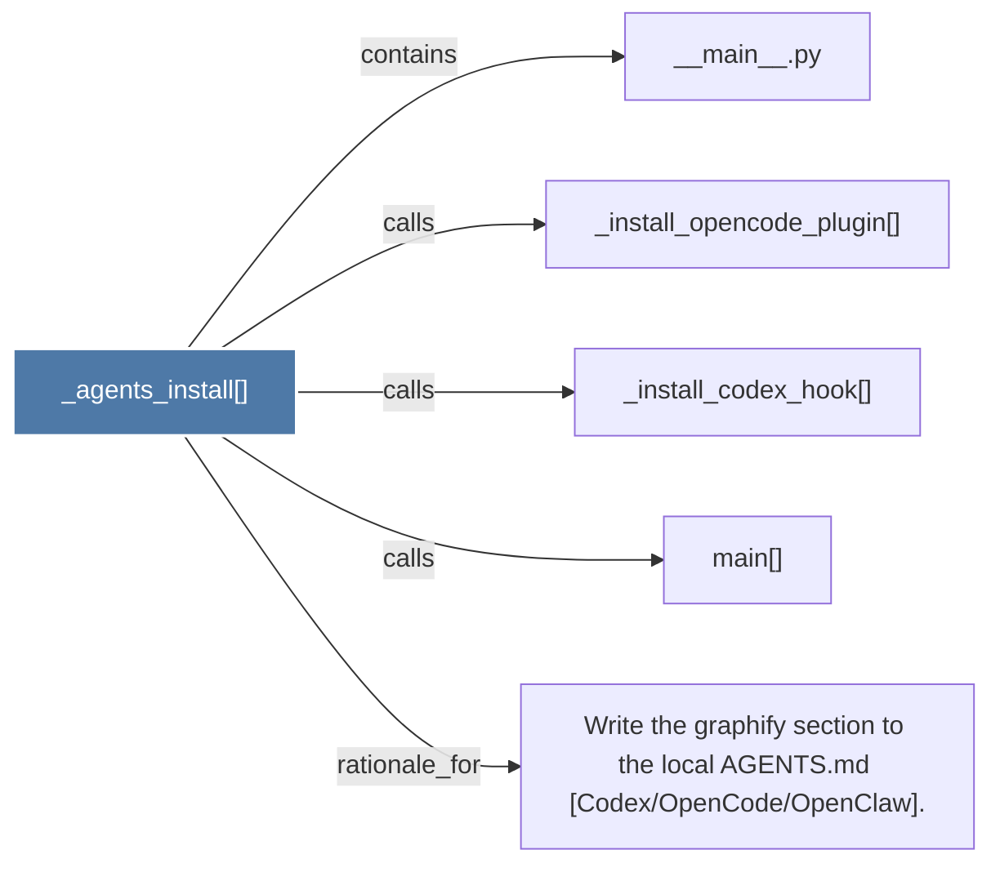

# _agents_install()

> [!info] Properties
> **File Type**: code
> **Community**: [[_COMMUNITY_Community None|Community None]]
> **Degree**: 5

## Architecture Graph


## Outbound Connections
- [[Write the graphify section to the local AGENTS.md (CodexOpenCodeOpenClaw).]] - `rationale_for` [EXTRACTED]
- [[__main__.py]] - `contains` [EXTRACTED]
- [[_install_codex_hook()]] - `calls` [EXTRACTED]
- [[_install_opencode_plugin()]] - `calls` [EXTRACTED]
- [[main()_2]] - `calls` [EXTRACTED]

## Inbound Dependencies
> [!abstract]- Files that link here
```dataview
LIST
FROM [[_agents_install()_1]]
```

#graphify/code #graphify/EXTRACTED #community/Community_None