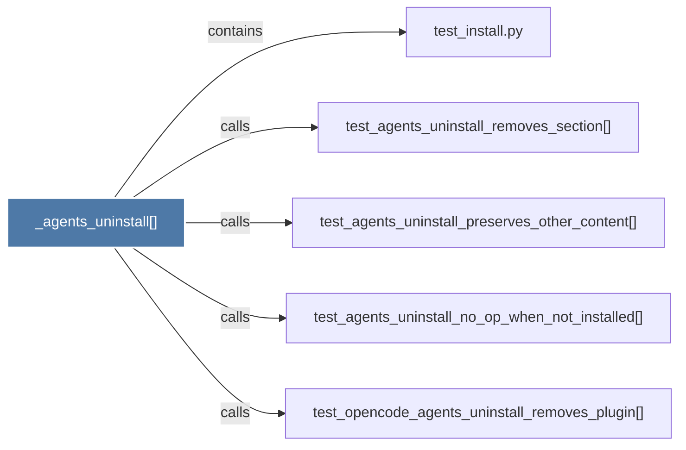

# _agents_uninstall()

> [!info] Properties
> **File Type**: code
> **Community**: [[_COMMUNITY_Community None|Community None]]
> **Degree**: 5

## Architecture Graph


## Outbound Connections
- [[test_agents_uninstall_no_op_when_not_installed()]] - `calls` [EXTRACTED]
- [[test_agents_uninstall_preserves_other_content()]] - `calls` [EXTRACTED]
- [[test_agents_uninstall_removes_section()]] - `calls` [EXTRACTED]
- [[test_install.py]] - `contains` [EXTRACTED]
- [[test_opencode_agents_uninstall_removes_plugin()]] - `calls` [EXTRACTED]

## Inbound Dependencies
> [!abstract]- Files that link here
```dataview
LIST
FROM [[_agents_uninstall()]]
```

#graphify/code #graphify/EXTRACTED #community/Community_None