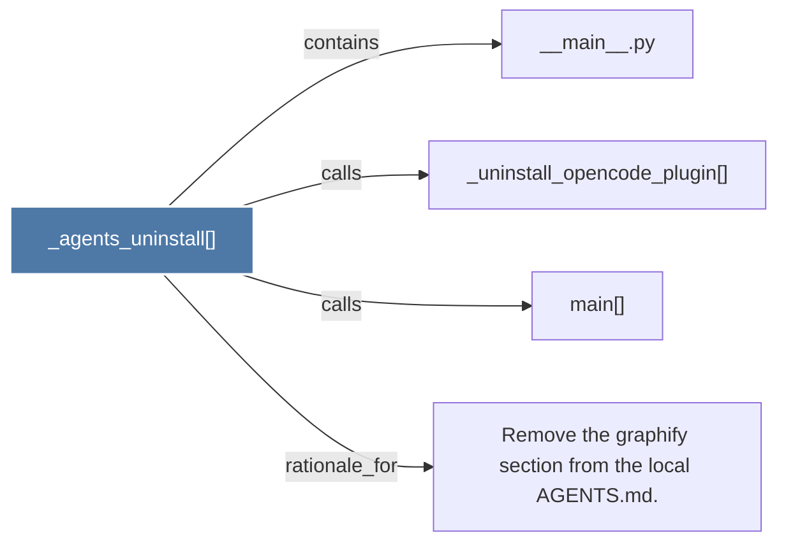

# _agents_uninstall()

> [!info] Properties
> **File Type**: code
> **Community**: [[_COMMUNITY_Community None|Community None]]
> **Degree**: 4

## Architecture Graph


## Outbound Connections
- [[Remove the graphify section from the local AGENTS.md.]] - `rationale_for` [EXTRACTED]
- [[__main__.py]] - `contains` [EXTRACTED]
- [[_uninstall_opencode_plugin()]] - `calls` [EXTRACTED]
- [[main()_2]] - `calls` [EXTRACTED]

## Inbound Dependencies
> [!abstract]- Files that link here
```dataview
LIST
FROM [[_agents_uninstall()_1]]
```

#graphify/code #graphify/EXTRACTED #community/Community_None