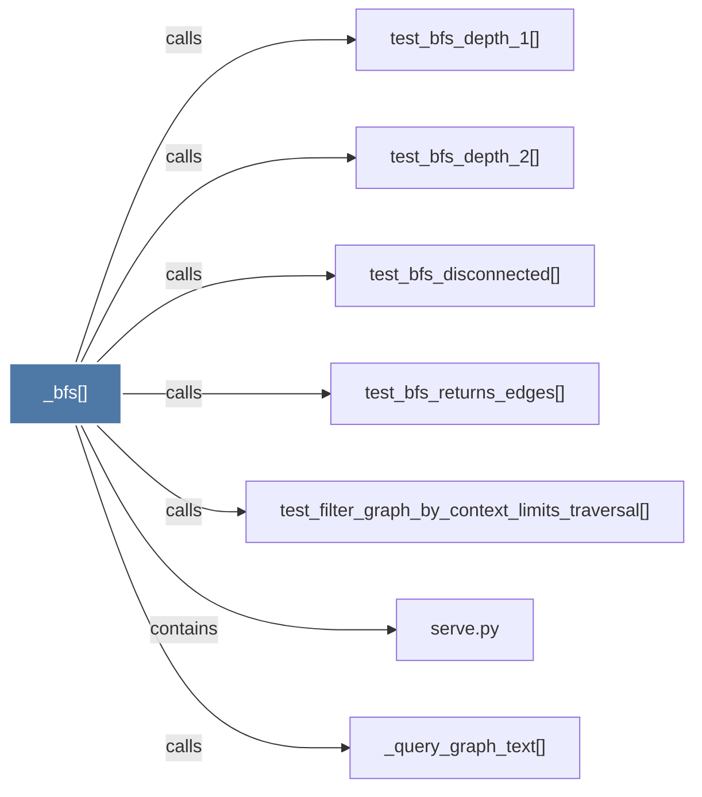

# _bfs()

> [!info] Properties
> **File Type**: code
> **Community**: [[_COMMUNITY_Community None|Community None]]
> **Degree**: 7

## Architecture Graph


## Outbound Connections
- [[_query_graph_text()]] - `calls` [EXTRACTED]
- [[serve.py]] - `contains` [EXTRACTED]
- [[test_bfs_depth_1()]] - `calls` [INFERRED]
- [[test_bfs_depth_2()]] - `calls` [INFERRED]
- [[test_bfs_disconnected()]] - `calls` [INFERRED]
- [[test_bfs_returns_edges()]] - `calls` [INFERRED]
- [[test_filter_graph_by_context_limits_traversal()]] - `calls` [INFERRED]

## Inbound Dependencies
> [!abstract]- Files that link here
```dataview
LIST
FROM [[_bfs()]]
```

#graphify/code #graphify/INFERRED #community/Community_None