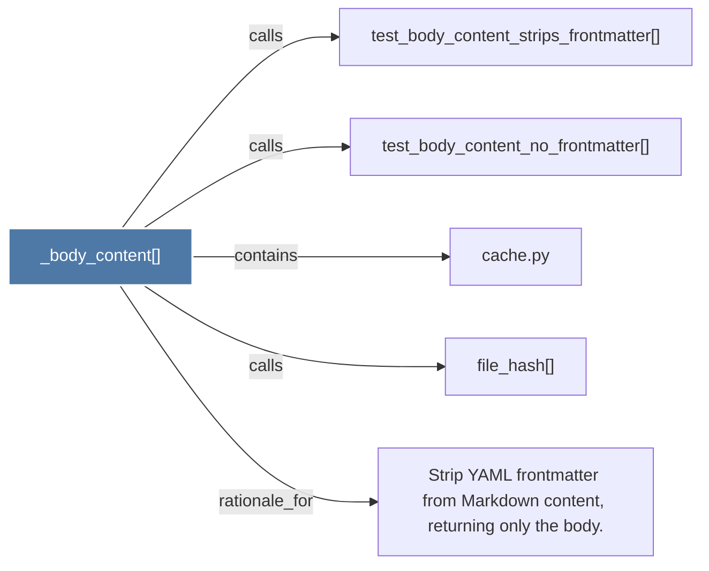

# _body_content()

> [!info] Properties
> **File Type**: code
> **Community**: [[_COMMUNITY_Community None|Community None]]
> **Degree**: 5

## Architecture Graph


## Outbound Connections
- [[Strip YAML frontmatter from Markdown content, returning only the body.]] - `rationale_for` [EXTRACTED]
- [[cache.py]] - `contains` [EXTRACTED]
- [[file_hash()]] - `calls` [EXTRACTED]
- [[test_body_content_no_frontmatter()]] - `calls` [INFERRED]
- [[test_body_content_strips_frontmatter()]] - `calls` [INFERRED]

## Inbound Dependencies
> [!abstract]- Files that link here
```dataview
LIST
FROM [[_body_content()]]
```

#graphify/code #graphify/EXTRACTED #community/Community_None