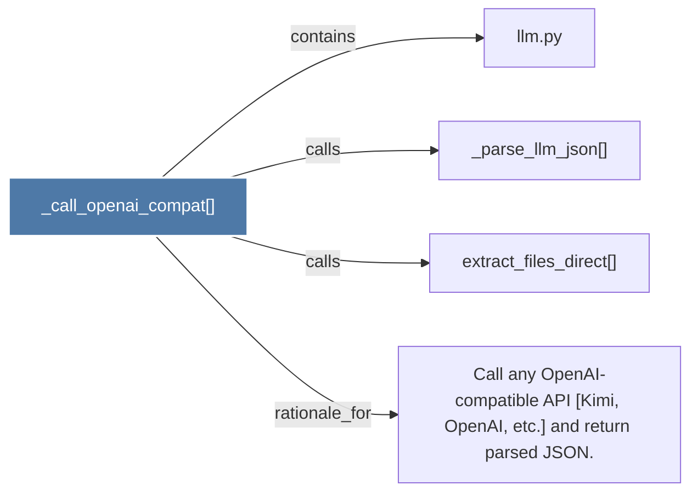

# _call_openai_compat()

> [!info] Properties
> **File Type**: code
> **Community**: [[_COMMUNITY_Community None|Community None]]
> **Degree**: 4

## Architecture Graph


## Outbound Connections
- [[Call any OpenAI-compatible API (Kimi, OpenAI, etc.) and return parsed JSON.]] - `rationale_for` [EXTRACTED]
- [[_parse_llm_json()]] - `calls` [EXTRACTED]
- [[extract_files_direct()]] - `calls` [EXTRACTED]
- [[llm.py]] - `contains` [EXTRACTED]

## Inbound Dependencies
> [!abstract]- Files that link here
```dataview
LIST
FROM [[_call_openai_compat()]]
```

#graphify/code #graphify/EXTRACTED #community/Community_None