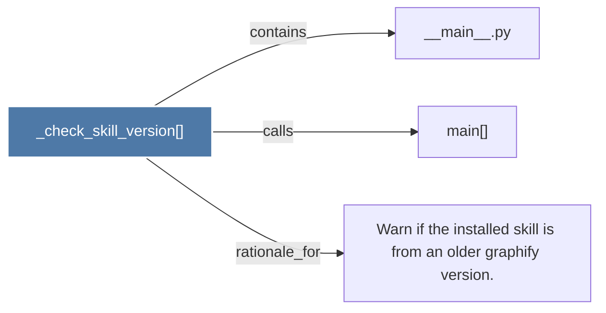

# _check_skill_version()

> [!info] Properties
> **File Type**: code
> **Community**: [[_COMMUNITY_Community None|Community None]]
> **Degree**: 3

## Architecture Graph


## Outbound Connections
- [[Warn if the installed skill is from an older graphify version.]] - `rationale_for` [EXTRACTED]
- [[__main__.py]] - `contains` [EXTRACTED]
- [[main()_2]] - `calls` [EXTRACTED]

## Inbound Dependencies
> [!abstract]- Files that link here
```dataview
LIST
FROM [[_check_skill_version()]]
```

#graphify/code #graphify/EXTRACTED #community/Community_None