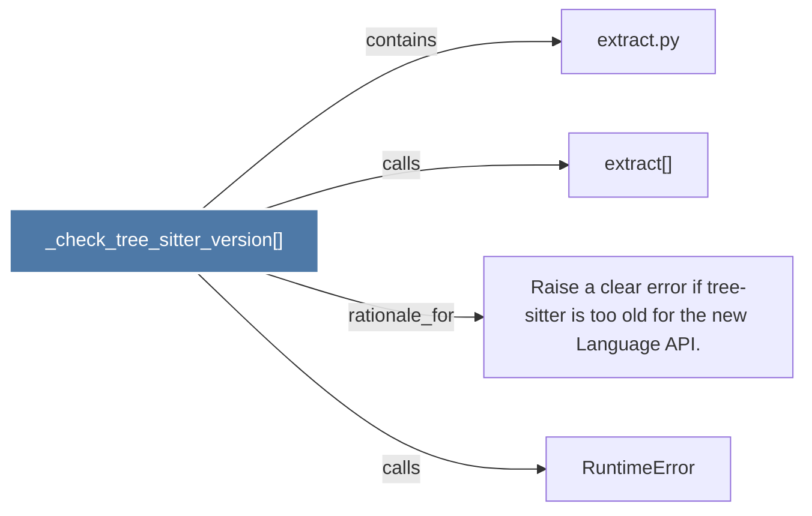

# _check_tree_sitter_version()

> [!info] Properties
> **File Type**: code
> **Community**: [[_COMMUNITY_Community None|Community None]]
> **Degree**: 4

## Architecture Graph


## Outbound Connections
- [[Raise a clear error if tree-sitter is too old for the new Language API.]] - `rationale_for` [EXTRACTED]
- [[RuntimeError]] - `calls` [INFERRED]
- [[extract()]] - `calls` [EXTRACTED]
- [[extract.py]] - `contains` [EXTRACTED]

## Inbound Dependencies
> [!abstract]- Files that link here
```dataview
LIST
FROM [[_check_tree_sitter_version()]]
```

#graphify/code #graphify/EXTRACTED #community/Community_None