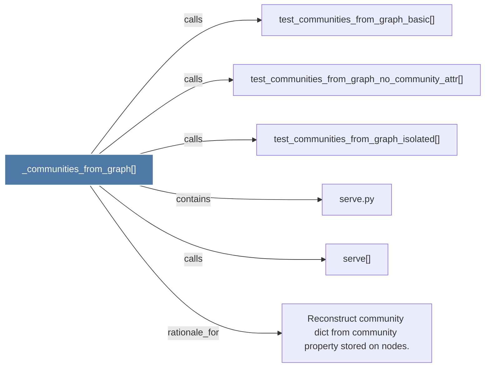

# _communities_from_graph()

> [!info] Properties
> **File Type**: code
> **Community**: [[_COMMUNITY_Community None|Community None]]
> **Degree**: 6

## Architecture Graph


## Outbound Connections
- [[Reconstruct community dict from community property stored on nodes.]] - `rationale_for` [EXTRACTED]
- [[serve()]] - `calls` [EXTRACTED]
- [[serve.py]] - `contains` [EXTRACTED]
- [[test_communities_from_graph_basic()]] - `calls` [INFERRED]
- [[test_communities_from_graph_isolated()]] - `calls` [INFERRED]
- [[test_communities_from_graph_no_community_attr()]] - `calls` [INFERRED]

## Inbound Dependencies
> [!abstract]- Files that link here
```dataview
LIST
FROM [[_communities_from_graph()]]
```

#graphify/code #graphify/INFERRED #community/Community_None