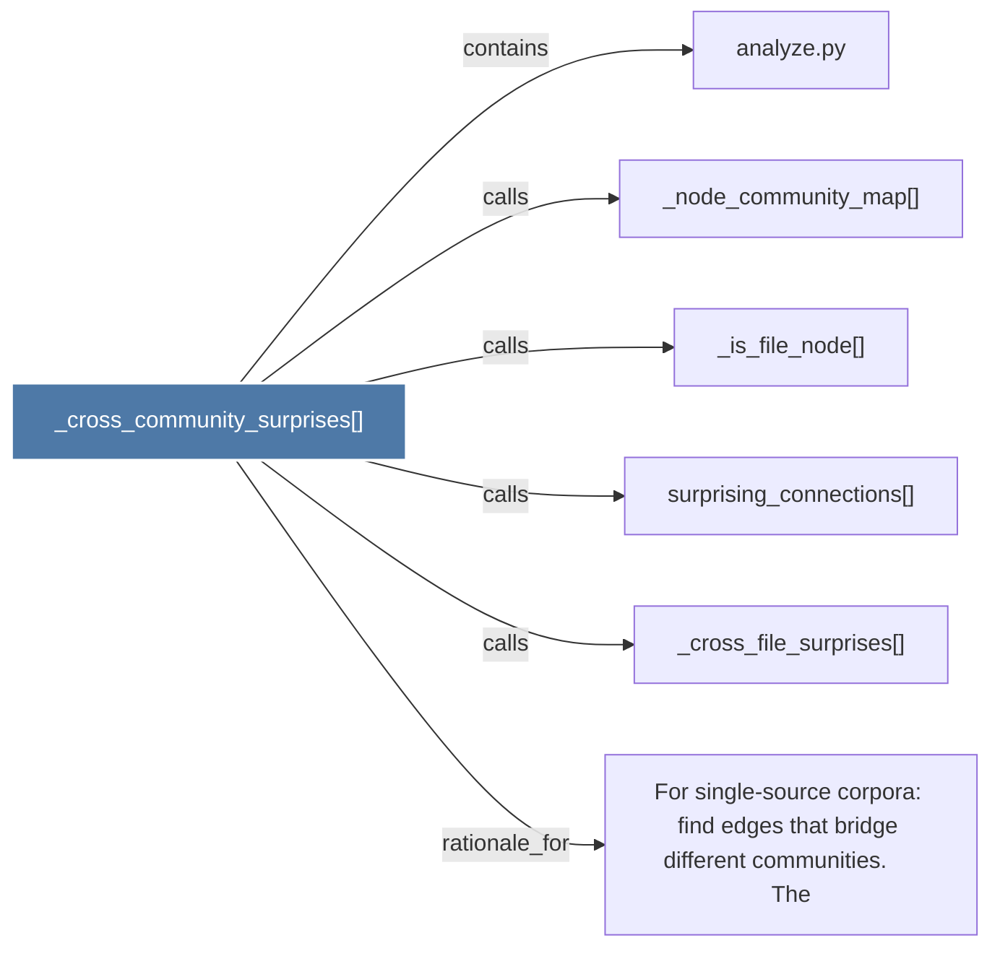

# _cross_community_surprises()

> [!info] Properties
> **File Type**: code
> **Community**: [[_COMMUNITY_Community None|Community None]]
> **Degree**: 6

## Architecture Graph


## Outbound Connections
- [[For single-source corpora find edges that bridge different communities.     The_1]] - `rationale_for` [EXTRACTED]
- [[_cross_file_surprises()_1]] - `calls` [EXTRACTED]
- [[_is_file_node()_1]] - `calls` [EXTRACTED]
- [[_node_community_map()_1]] - `calls` [EXTRACTED]
- [[analyze.py_1]] - `contains` [EXTRACTED]
- [[surprising_connections()_1]] - `calls` [EXTRACTED]

## Inbound Dependencies
> [!abstract]- Files that link here
```dataview
LIST
FROM [[_cross_community_surprises()_1]]
```

#graphify/code #graphify/EXTRACTED #community/Community_None