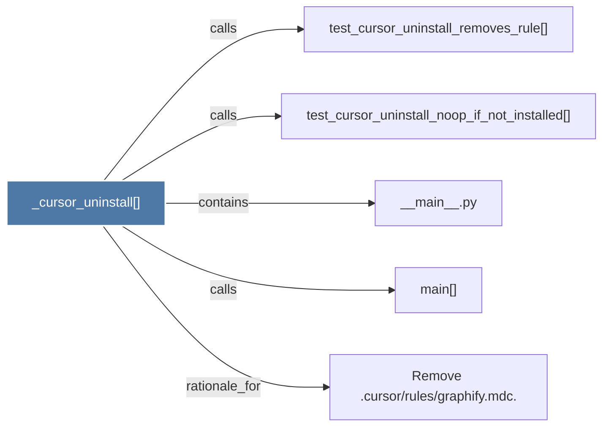

# _cursor_uninstall()

> [!info] Properties
> **File Type**: code
> **Community**: [[_COMMUNITY_Community None|Community None]]
> **Degree**: 5

## Architecture Graph


## Outbound Connections
- [[Remove .cursorrulesgraphify.mdc.]] - `rationale_for` [EXTRACTED]
- [[__main__.py]] - `contains` [EXTRACTED]
- [[main()_2]] - `calls` [EXTRACTED]
- [[test_cursor_uninstall_noop_if_not_installed()]] - `calls` [INFERRED]
- [[test_cursor_uninstall_removes_rule()]] - `calls` [INFERRED]

## Inbound Dependencies
> [!abstract]- Files that link here
```dataview
LIST
FROM [[_cursor_uninstall()]]
```

#graphify/code #graphify/EXTRACTED #community/Community_None