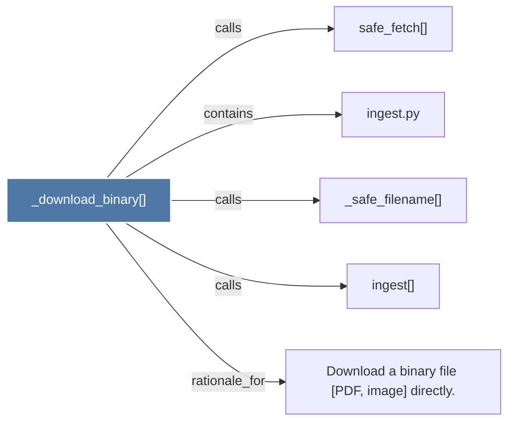

# _download_binary()

> [!info] Properties
> **File Type**: code
> **Community**: [[_COMMUNITY_Community None|Community None]]
> **Degree**: 5

## Architecture Graph


## Outbound Connections
- [[Download a binary file (PDF, image) directly.]] - `rationale_for` [EXTRACTED]
- [[_safe_filename()_1]] - `calls` [EXTRACTED]
- [[ingest()]] - `calls` [EXTRACTED]
- [[ingest.py]] - `contains` [EXTRACTED]
- [[safe_fetch()]] - `calls` [INFERRED]

## Inbound Dependencies
> [!abstract]- Files that link here
```dataview
LIST
FROM [[_download_binary()]]
```

#graphify/code #graphify/EXTRACTED #community/Community_None