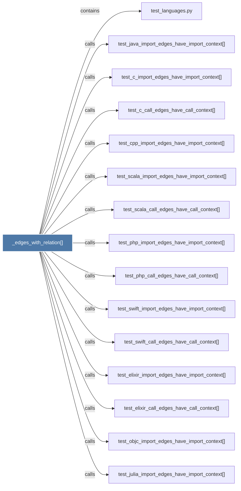

# _edges_with_relation()

> [!info] Properties
> **File Type**: code
> **Community**: [[_COMMUNITY_Community None|Community None]]
> **Degree**: 16

## Architecture Graph


## Outbound Connections
- [[test_c_call_edges_have_call_context()]] - `calls` [EXTRACTED]
- [[test_c_import_edges_have_import_context()]] - `calls` [EXTRACTED]
- [[test_cpp_import_edges_have_import_context()]] - `calls` [EXTRACTED]
- [[test_elixir_call_edges_have_call_context()]] - `calls` [EXTRACTED]
- [[test_elixir_import_edges_have_import_context()]] - `calls` [EXTRACTED]
- [[test_java_import_edges_have_import_context()]] - `calls` [EXTRACTED]
- [[test_julia_call_edges_have_call_context()]] - `calls` [EXTRACTED]
- [[test_julia_import_edges_have_import_context()]] - `calls` [EXTRACTED]
- [[test_languages.py]] - `contains` [EXTRACTED]
- [[test_objc_import_edges_have_import_context()]] - `calls` [EXTRACTED]
- [[test_php_call_edges_have_call_context()]] - `calls` [EXTRACTED]
- [[test_php_import_edges_have_import_context()]] - `calls` [EXTRACTED]
- [[test_scala_call_edges_have_call_context()]] - `calls` [EXTRACTED]
- [[test_scala_import_edges_have_import_context()]] - `calls` [EXTRACTED]
- [[test_swift_call_edges_have_call_context()]] - `calls` [EXTRACTED]
- [[test_swift_import_edges_have_import_context()]] - `calls` [EXTRACTED]

## Inbound Dependencies
> [!abstract]- Files that link here
```dataview
LIST
FROM [[_edges_with_relation()]]
```

#graphify/code #graphify/EXTRACTED #community/Community_None