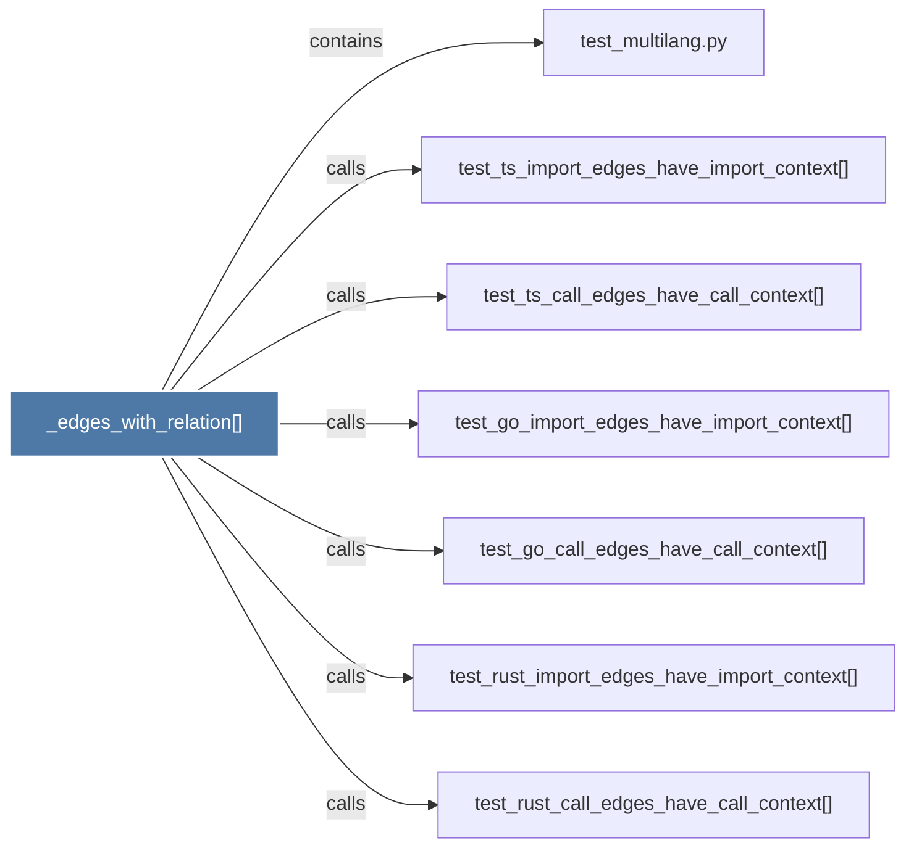

# _edges_with_relation()

> [!info] Properties
> **File Type**: code
> **Community**: [[_COMMUNITY_Community None|Community None]]
> **Degree**: 7

## Architecture Graph


## Outbound Connections
- [[test_go_call_edges_have_call_context()]] - `calls` [EXTRACTED]
- [[test_go_import_edges_have_import_context()]] - `calls` [EXTRACTED]
- [[test_multilang.py]] - `contains` [EXTRACTED]
- [[test_rust_call_edges_have_call_context()]] - `calls` [EXTRACTED]
- [[test_rust_import_edges_have_import_context()]] - `calls` [EXTRACTED]
- [[test_ts_call_edges_have_call_context()]] - `calls` [EXTRACTED]
- [[test_ts_import_edges_have_import_context()]] - `calls` [EXTRACTED]

## Inbound Dependencies
> [!abstract]- Files that link here
```dataview
LIST
FROM [[_edges_with_relation()_1]]
```

#graphify/code #graphify/EXTRACTED #community/Community_None