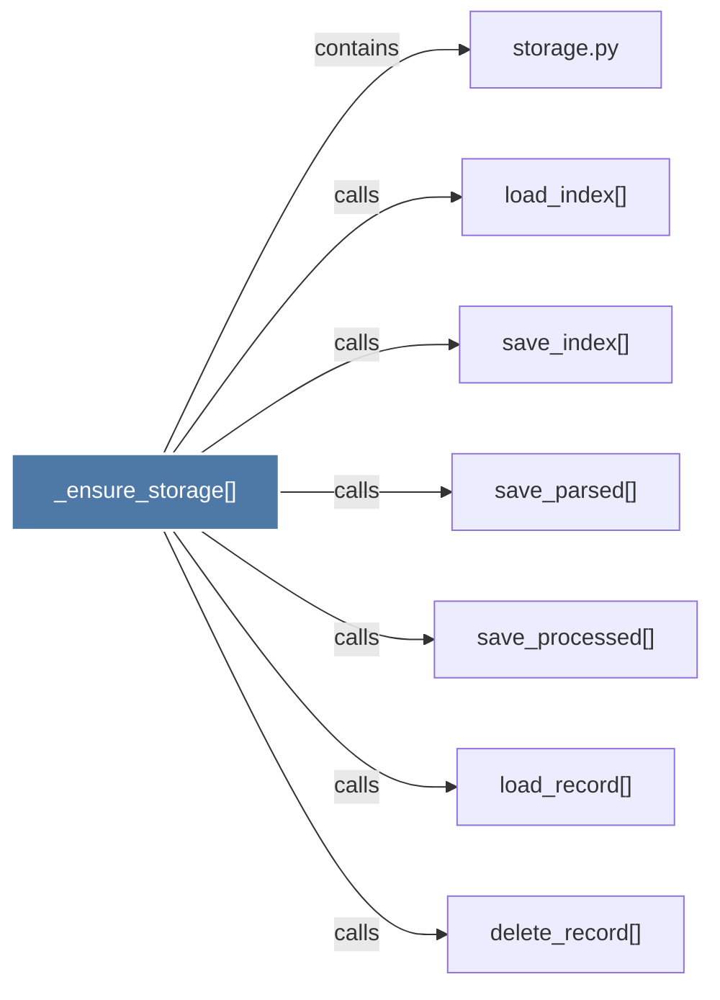

# _ensure_storage()

> [!info] Properties
> **File Type**: code
> **Community**: [[_COMMUNITY_Community None|Community None]]
> **Degree**: 7

## Architecture Graph


## Outbound Connections
- [[delete_record()]] - `calls` [EXTRACTED]
- [[load_index()]] - `calls` [EXTRACTED]
- [[load_record()]] - `calls` [EXTRACTED]
- [[save_index()]] - `calls` [EXTRACTED]
- [[save_parsed()]] - `calls` [EXTRACTED]
- [[save_processed()]] - `calls` [EXTRACTED]
- [[storage.py]] - `contains` [EXTRACTED]

## Inbound Dependencies
> [!abstract]- Files that link here
```dataview
LIST
FROM [[_ensure_storage()]]
```

#graphify/code #graphify/EXTRACTED #community/Community_None