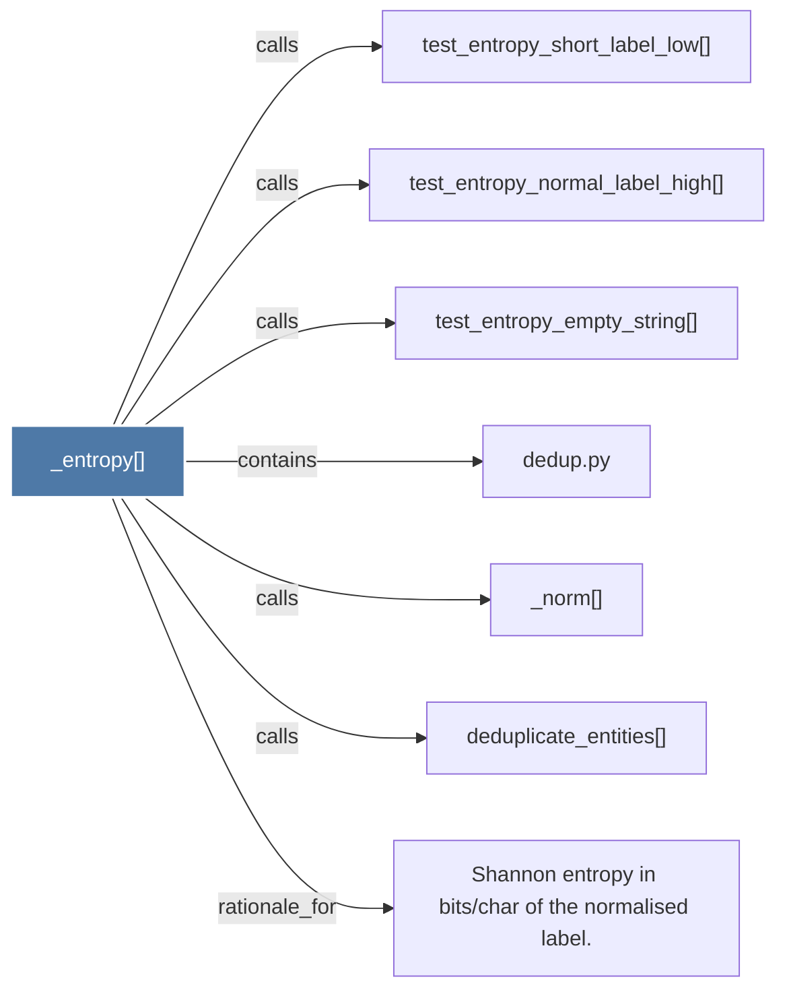

# _entropy()

> [!info] Properties
> **File Type**: code
> **Community**: [[_COMMUNITY_Community None|Community None]]
> **Degree**: 7

## Architecture Graph


## Outbound Connections
- [[Shannon entropy in bitschar of the normalised label.]] - `rationale_for` [EXTRACTED]
- [[_norm()]] - `calls` [EXTRACTED]
- [[dedup.py]] - `contains` [EXTRACTED]
- [[deduplicate_entities()]] - `calls` [EXTRACTED]
- [[test_entropy_empty_string()]] - `calls` [INFERRED]
- [[test_entropy_normal_label_high()]] - `calls` [INFERRED]
- [[test_entropy_short_label_low()]] - `calls` [INFERRED]

## Inbound Dependencies
> [!abstract]- Files that link here
```dataview
LIST
FROM [[_entropy()]]
```

#graphify/code #graphify/EXTRACTED #community/Community_None