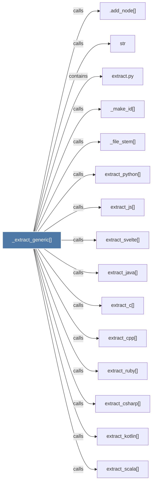

# _extract_generic()

> [!info] Properties
> **File Type**: code
> **Community**: [[_COMMUNITY_Community None|Community None]]
> **Degree**: 19

## Architecture Graph


## Outbound Connections
- [[.add_node()]] - `calls` [INFERRED]
- [[Generic AST extractor driven by LanguageConfig.]] - `rationale_for` [EXTRACTED]
- [[_file_stem()]] - `calls` [EXTRACTED]
- [[_make_id()]] - `calls` [EXTRACTED]
- [[extract.py]] - `contains` [EXTRACTED]
- [[extract_c()]] - `calls` [EXTRACTED]
- [[extract_cpp()]] - `calls` [EXTRACTED]
- [[extract_csharp()]] - `calls` [EXTRACTED]
- [[extract_java()]] - `calls` [EXTRACTED]
- [[extract_js()]] - `calls` [EXTRACTED]
- [[extract_kotlin()]] - `calls` [EXTRACTED]
- [[extract_lua()]] - `calls` [EXTRACTED]
- [[extract_php()]] - `calls` [EXTRACTED]
- [[extract_python()]] - `calls` [EXTRACTED]
- [[extract_ruby()]] - `calls` [EXTRACTED]
- [[extract_scala()]] - `calls` [EXTRACTED]
- [[extract_svelte()]] - `calls` [EXTRACTED]
- [[extract_swift()]] - `calls` [EXTRACTED]
- [[str]] - `calls` [INFERRED]

## Inbound Dependencies
> [!abstract]- Files that link here
```dataview
LIST
FROM [[_extract_generic()]]
```

#graphify/code #graphify/EXTRACTED #community/Community_None