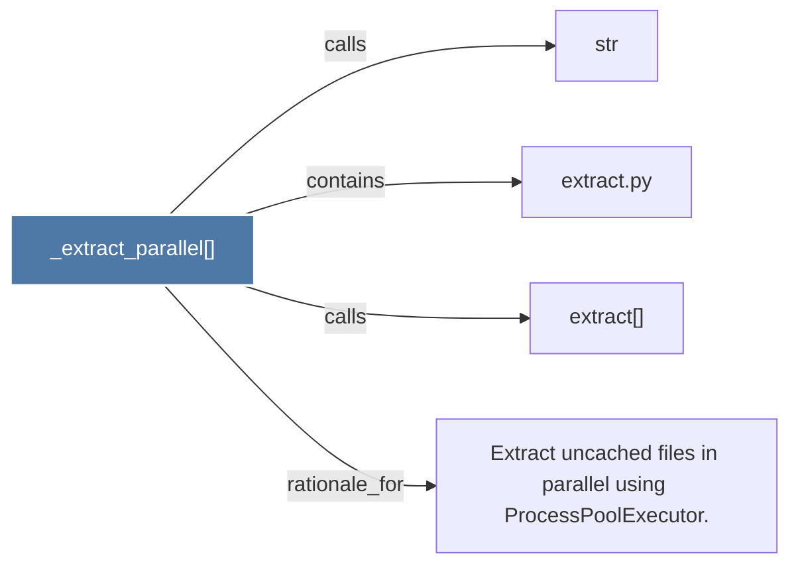

# _extract_parallel()

> [!info] Properties
> **File Type**: code
> **Community**: [[_COMMUNITY_Community None|Community None]]
> **Degree**: 4

## Architecture Graph


## Outbound Connections
- [[Extract uncached files in parallel using ProcessPoolExecutor.]] - `rationale_for` [EXTRACTED]
- [[extract()]] - `calls` [EXTRACTED]
- [[extract.py]] - `contains` [EXTRACTED]
- [[str]] - `calls` [INFERRED]

## Inbound Dependencies
> [!abstract]- Files that link here
```dataview
LIST
FROM [[_extract_parallel()]]
```

#graphify/code #graphify/EXTRACTED #community/Community_None