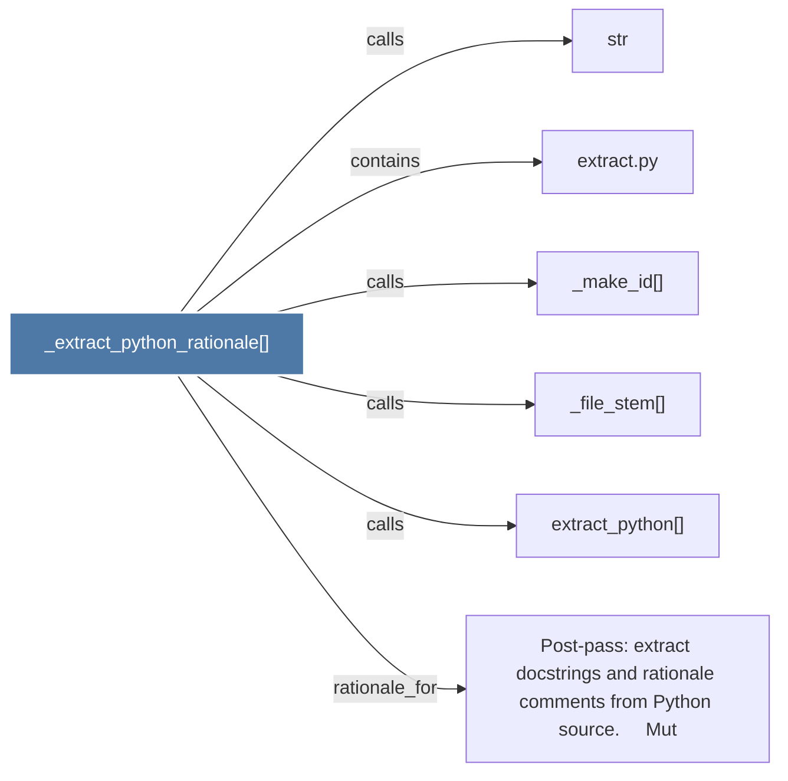

# _extract_python_rationale()

> [!info] Properties
> **File Type**: code
> **Community**: [[_COMMUNITY_Community None|Community None]]
> **Degree**: 6

## Architecture Graph


## Outbound Connections
- [[Post-pass extract docstrings and rationale comments from Python source.     Mut]] - `rationale_for` [EXTRACTED]
- [[_file_stem()]] - `calls` [EXTRACTED]
- [[_make_id()]] - `calls` [EXTRACTED]
- [[extract.py]] - `contains` [EXTRACTED]
- [[extract_python()]] - `calls` [EXTRACTED]
- [[str]] - `calls` [INFERRED]

## Inbound Dependencies
> [!abstract]- Files that link here
```dataview
LIST
FROM [[_extract_python_rationale()]]
```

#graphify/code #graphify/EXTRACTED #community/Community_None