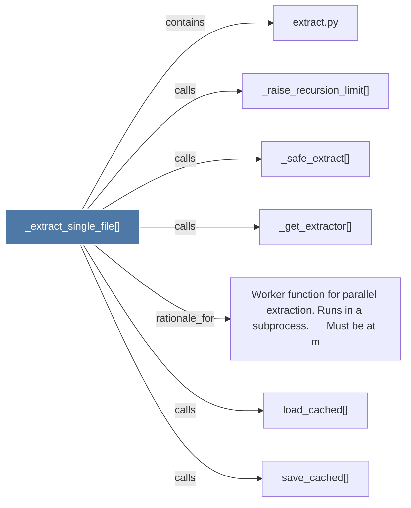

# _extract_single_file()

> [!info] Properties
> **File Type**: code
> **Community**: [[_COMMUNITY_Community None|Community None]]
> **Degree**: 7

## Architecture Graph


## Outbound Connections
- [[Worker function for parallel extraction. Runs in a subprocess.      Must be at m]] - `rationale_for` [EXTRACTED]
- [[_get_extractor()]] - `calls` [EXTRACTED]
- [[_raise_recursion_limit()]] - `calls` [EXTRACTED]
- [[_safe_extract()]] - `calls` [EXTRACTED]
- [[extract.py]] - `contains` [EXTRACTED]
- [[load_cached()]] - `calls` [INFERRED]
- [[save_cached()]] - `calls` [INFERRED]

## Inbound Dependencies
> [!abstract]- Files that link here
```dataview
LIST
FROM [[_extract_single_file()]]
```

#graphify/code #graphify/EXTRACTED #community/Community_None