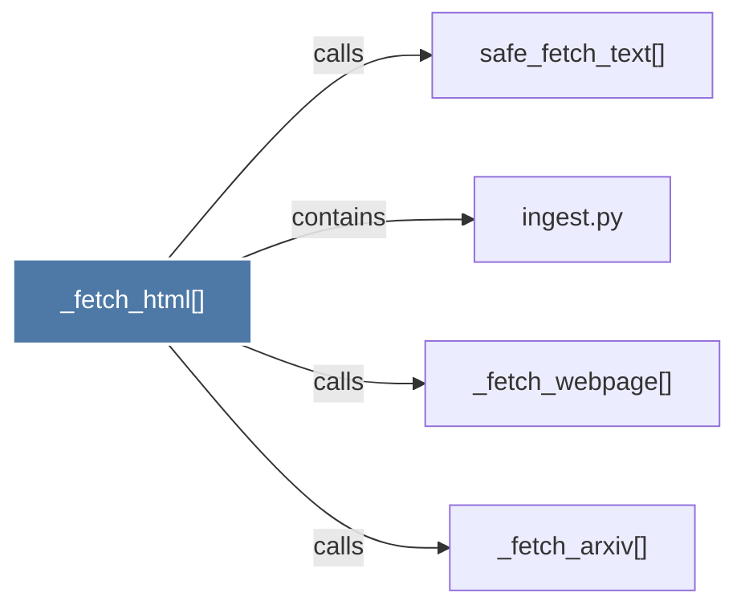

# _fetch_html()

> [!info] Properties
> **File Type**: code
> **Community**: [[_COMMUNITY_Community None|Community None]]
> **Degree**: 4

## Architecture Graph


## Outbound Connections
- [[_fetch_arxiv()]] - `calls` [EXTRACTED]
- [[_fetch_webpage()]] - `calls` [EXTRACTED]
- [[ingest.py]] - `contains` [EXTRACTED]
- [[safe_fetch_text()]] - `calls` [INFERRED]

## Inbound Dependencies
> [!abstract]- Files that link here
```dataview
LIST
FROM [[_fetch_html()]]
```

#graphify/code #graphify/EXTRACTED #community/Community_None