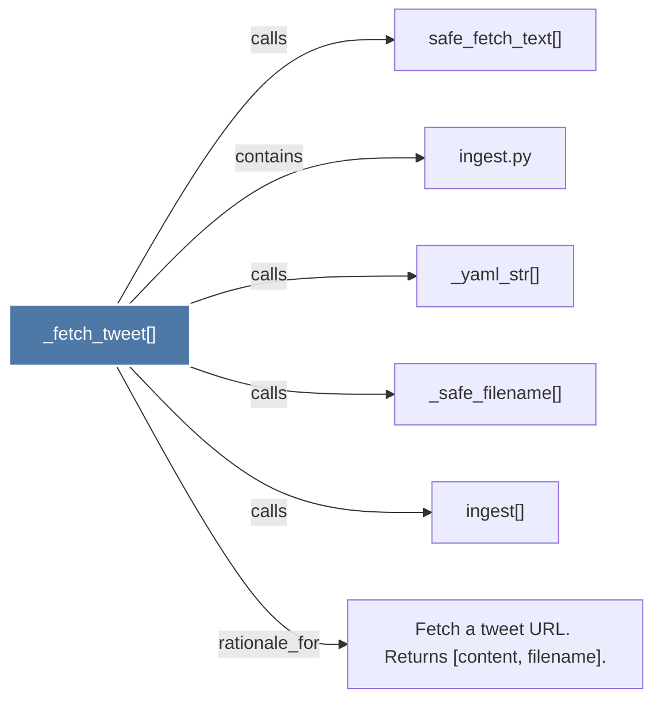

# _fetch_tweet()

> [!info] Properties
> **File Type**: code
> **Community**: [[_COMMUNITY_Community None|Community None]]
> **Degree**: 6

## Architecture Graph


## Outbound Connections
- [[Fetch a tweet URL. Returns (content, filename).]] - `rationale_for` [EXTRACTED]
- [[_safe_filename()_1]] - `calls` [EXTRACTED]
- [[_yaml_str()]] - `calls` [EXTRACTED]
- [[ingest()]] - `calls` [EXTRACTED]
- [[ingest.py]] - `contains` [EXTRACTED]
- [[safe_fetch_text()]] - `calls` [INFERRED]

## Inbound Dependencies
> [!abstract]- Files that link here
```dataview
LIST
FROM [[_fetch_tweet()]]
```

#graphify/code #graphify/EXTRACTED #community/Community_None