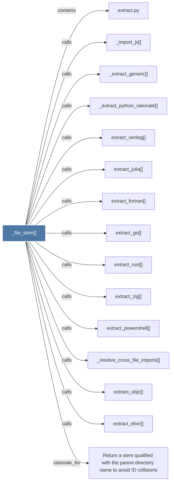

# _file_stem()

> [!info] Properties
> **File Type**: code
> **Community**: [[_COMMUNITY_Community None|Community None]]
> **Degree**: 15

## Architecture Graph


## Outbound Connections
- [[Return a stem qualified with the parent directory name to avoid ID collisions]] - `rationale_for` [EXTRACTED]
- [[_extract_generic()]] - `calls` [EXTRACTED]
- [[_extract_python_rationale()]] - `calls` [EXTRACTED]
- [[_import_js()]] - `calls` [EXTRACTED]
- [[_resolve_cross_file_imports()]] - `calls` [EXTRACTED]
- [[extract.py]] - `contains` [EXTRACTED]
- [[extract_elixir()]] - `calls` [EXTRACTED]
- [[extract_fortran()]] - `calls` [EXTRACTED]
- [[extract_go()]] - `calls` [EXTRACTED]
- [[extract_julia()]] - `calls` [EXTRACTED]
- [[extract_objc()]] - `calls` [EXTRACTED]
- [[extract_powershell()]] - `calls` [EXTRACTED]
- [[extract_rust()]] - `calls` [EXTRACTED]
- [[extract_verilog()]] - `calls` [EXTRACTED]
- [[extract_zig()]] - `calls` [EXTRACTED]

## Inbound Dependencies
> [!abstract]- Files that link here
```dataview
LIST
FROM [[_file_stem()]]
```

#graphify/code #graphify/EXTRACTED #community/Community_None