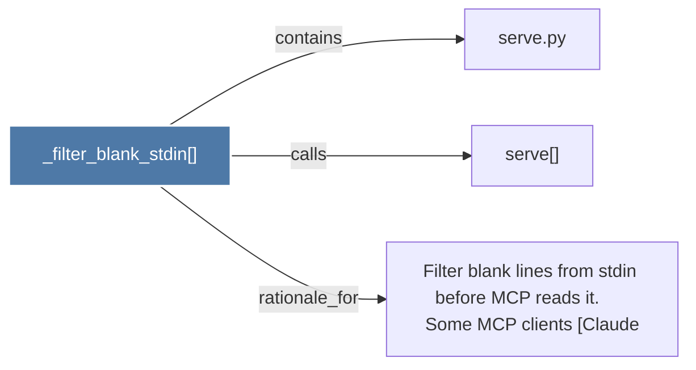

# _filter_blank_stdin()

> [!info] Properties
> **File Type**: code
> **Community**: [[_COMMUNITY_Community None|Community None]]
> **Degree**: 3

## Architecture Graph


## Outbound Connections
- [[Filter blank lines from stdin before MCP reads it.      Some MCP clients (Claude]] - `rationale_for` [EXTRACTED]
- [[serve()]] - `calls` [EXTRACTED]
- [[serve.py]] - `contains` [EXTRACTED]

## Inbound Dependencies
> [!abstract]- Files that link here
```dataview
LIST
FROM [[_filter_blank_stdin()]]
```

#graphify/code #graphify/EXTRACTED #community/Community_None