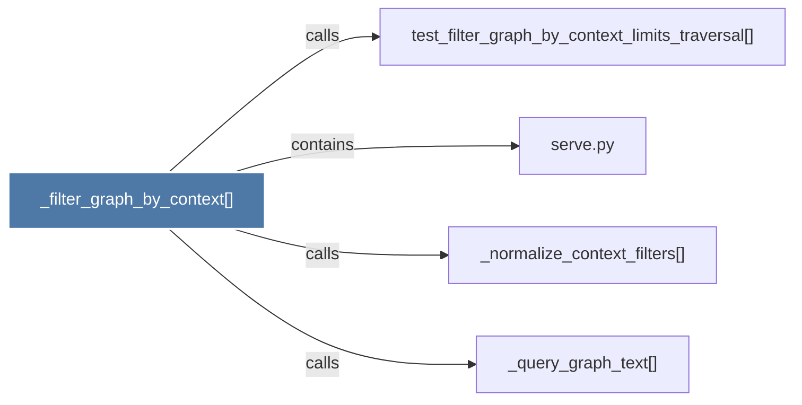

# _filter_graph_by_context()

> [!info] Properties
> **File Type**: code
> **Community**: [[_COMMUNITY_Community None|Community None]]
> **Degree**: 4

## Architecture Graph


## Outbound Connections
- [[_normalize_context_filters()]] - `calls` [EXTRACTED]
- [[_query_graph_text()]] - `calls` [EXTRACTED]
- [[serve.py]] - `contains` [EXTRACTED]
- [[test_filter_graph_by_context_limits_traversal()]] - `calls` [INFERRED]

## Inbound Dependencies
> [!abstract]- Files that link here
```dataview
LIST
FROM [[_filter_graph_by_context()]]
```

#graphify/code #graphify/EXTRACTED #community/Community_None