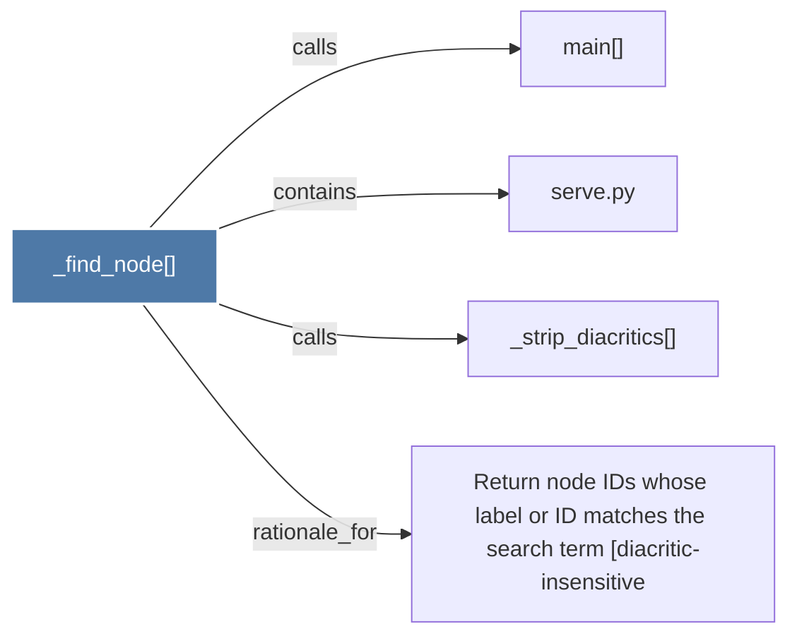

# _find_node()

> [!info] Properties
> **File Type**: code
> **Community**: [[_COMMUNITY_Community None|Community None]]
> **Degree**: 4

## Architecture Graph


## Outbound Connections
- [[Return node IDs whose label or ID matches the search term (diacritic-insensitive]] - `rationale_for` [EXTRACTED]
- [[_strip_diacritics()_1]] - `calls` [EXTRACTED]
- [[main()_2]] - `calls` [INFERRED]
- [[serve.py]] - `contains` [EXTRACTED]

## Inbound Dependencies
> [!abstract]- Files that link here
```dataview
LIST
FROM [[_find_node()]]
```

#graphify/code #graphify/EXTRACTED #community/Community_None