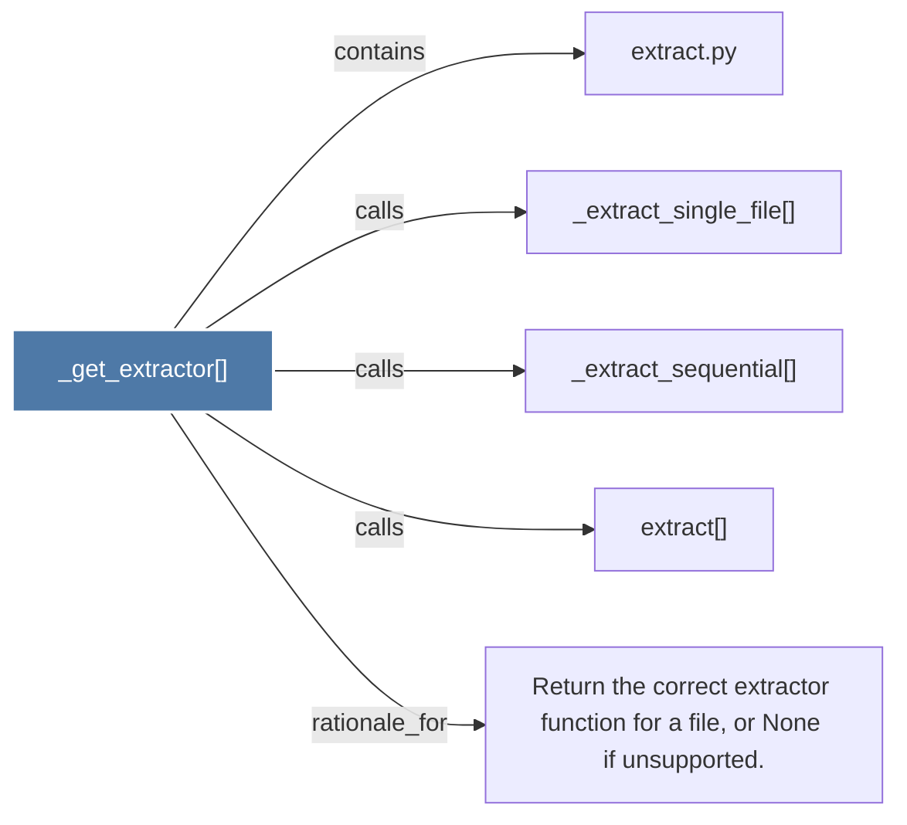

# _get_extractor()

> [!info] Properties
> **File Type**: code
> **Community**: [[_COMMUNITY_Community None|Community None]]
> **Degree**: 5

## Architecture Graph


## Outbound Connections
- [[Return the correct extractor function for a file, or None if unsupported.]] - `rationale_for` [EXTRACTED]
- [[_extract_sequential()]] - `calls` [EXTRACTED]
- [[_extract_single_file()]] - `calls` [EXTRACTED]
- [[extract()]] - `calls` [EXTRACTED]
- [[extract.py]] - `contains` [EXTRACTED]

## Inbound Dependencies
> [!abstract]- Files that link here
```dataview
LIST
FROM [[_get_extractor()]]
```

#graphify/code #graphify/EXTRACTED #community/Community_None