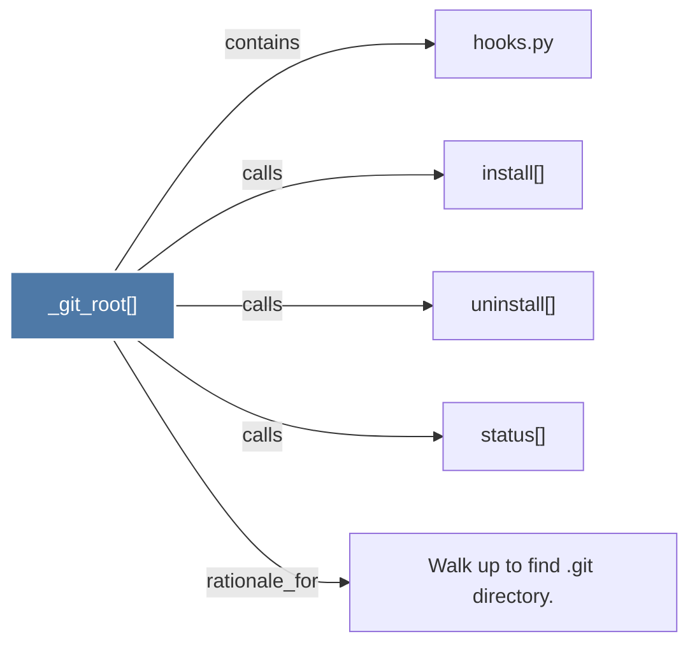

# _git_root()

> [!info] Properties
> **File Type**: code
> **Community**: [[_COMMUNITY_Community None|Community None]]
> **Degree**: 5

## Architecture Graph


## Outbound Connections
- [[Walk up to find .git directory.]] - `rationale_for` [EXTRACTED]
- [[hooks.py]] - `contains` [EXTRACTED]
- [[install()]] - `calls` [EXTRACTED]
- [[status()]] - `calls` [EXTRACTED]
- [[uninstall()]] - `calls` [EXTRACTED]

## Inbound Dependencies
> [!abstract]- Files that link here
```dataview
LIST
FROM [[_git_root()]]
```

#graphify/code #graphify/EXTRACTED #community/Community_None