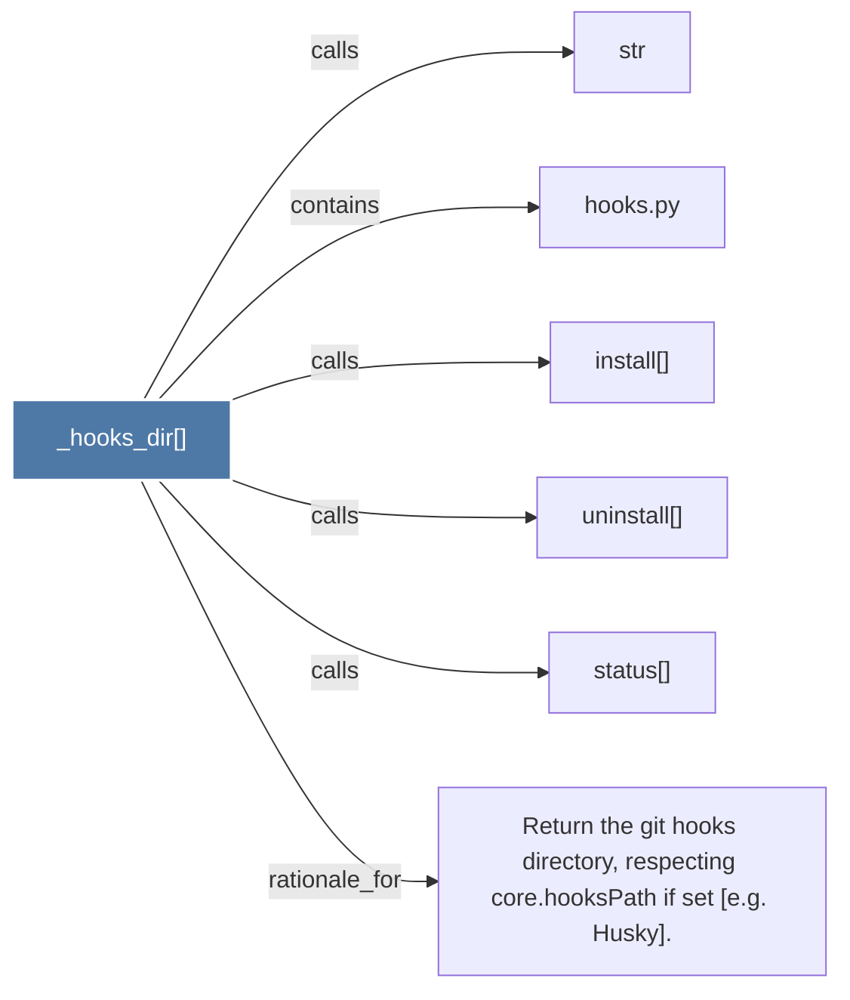

# _hooks_dir()

> [!info] Properties
> **File Type**: code
> **Community**: [[_COMMUNITY_Community None|Community None]]
> **Degree**: 6

## Architecture Graph


## Outbound Connections
- [[Return the git hooks directory, respecting core.hooksPath if set (e.g. Husky).]] - `rationale_for` [EXTRACTED]
- [[hooks.py]] - `contains` [EXTRACTED]
- [[install()]] - `calls` [EXTRACTED]
- [[status()]] - `calls` [EXTRACTED]
- [[str]] - `calls` [INFERRED]
- [[uninstall()]] - `calls` [EXTRACTED]

## Inbound Dependencies
> [!abstract]- Files that link here
```dataview
LIST
FROM [[_hooks_dir()]]
```

#graphify/code #graphify/EXTRACTED #community/Community_None