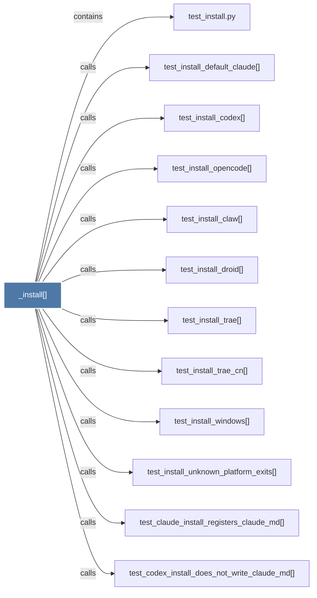

# _install()

> [!info] Properties
> **File Type**: code
> **Community**: [[_COMMUNITY_Community None|Community None]]
> **Degree**: 12

## Architecture Graph


## Outbound Connections
- [[test_claude_install_registers_claude_md()]] - `calls` [EXTRACTED]
- [[test_codex_install_does_not_write_claude_md()]] - `calls` [EXTRACTED]
- [[test_install.py]] - `contains` [EXTRACTED]
- [[test_install_claw()]] - `calls` [EXTRACTED]
- [[test_install_codex()]] - `calls` [EXTRACTED]
- [[test_install_default_claude()]] - `calls` [EXTRACTED]
- [[test_install_droid()]] - `calls` [EXTRACTED]
- [[test_install_opencode()]] - `calls` [EXTRACTED]
- [[test_install_trae()]] - `calls` [EXTRACTED]
- [[test_install_trae_cn()]] - `calls` [EXTRACTED]
- [[test_install_unknown_platform_exits()]] - `calls` [EXTRACTED]
- [[test_install_windows()]] - `calls` [EXTRACTED]

## Inbound Dependencies
> [!abstract]- Files that link here
```dataview
LIST
FROM [[_install()]]
```

#graphify/code #graphify/EXTRACTED #community/Community_None