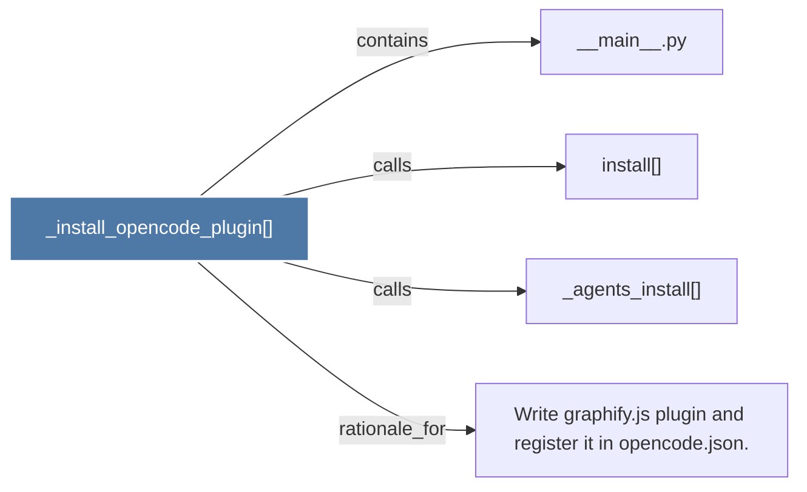

# _install_opencode_plugin()

> [!info] Properties
> **File Type**: code
> **Community**: [[_COMMUNITY_Community None|Community None]]
> **Degree**: 4

## Architecture Graph


## Outbound Connections
- [[Write graphify.js plugin and register it in opencode.json.]] - `rationale_for` [EXTRACTED]
- [[__main__.py]] - `contains` [EXTRACTED]
- [[_agents_install()_1]] - `calls` [EXTRACTED]
- [[install()_1]] - `calls` [EXTRACTED]

## Inbound Dependencies
> [!abstract]- Files that link here
```dataview
LIST
FROM [[_install_opencode_plugin()]]
```

#graphify/code #graphify/EXTRACTED #community/Community_None