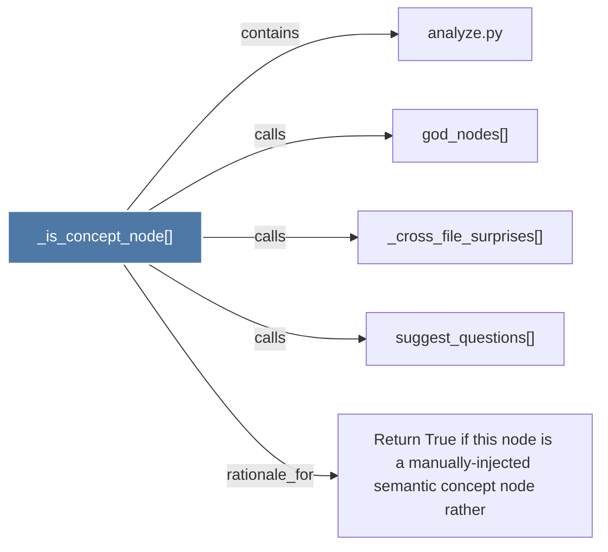

# _is_concept_node()

> [!info] Properties
> **File Type**: code
> **Community**: [[_COMMUNITY_Community None|Community None]]
> **Degree**: 5

## Architecture Graph


## Outbound Connections
- [[Return True if this node is a manually-injected semantic concept node     rather]] - `rationale_for` [EXTRACTED]
- [[_cross_file_surprises()]] - `calls` [EXTRACTED]
- [[analyze.py]] - `contains` [EXTRACTED]
- [[god_nodes()]] - `calls` [EXTRACTED]
- [[suggest_questions()]] - `calls` [EXTRACTED]

## Inbound Dependencies
> [!abstract]- Files that link here
```dataview
LIST
FROM [[_is_concept_node()]]
```

#graphify/code #graphify/EXTRACTED #community/Community_None