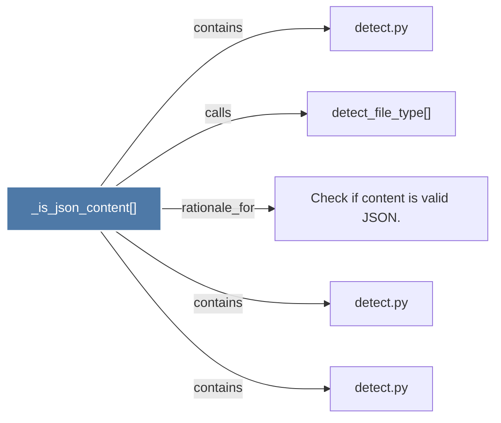

# _is_json_content()

> [!info] Properties
> **File Type**: code
> **Community**: [[_COMMUNITY_Community None|Community None]]
> **Degree**: 5

## Architecture Graph


## Outbound Connections
- [[Check if content is valid JSON.]] - `rationale_for` [EXTRACTED]
- [[detect.py_1]] - `contains` [EXTRACTED]
- [[detect.py_2]] - `contains` [EXTRACTED]
- [[detect.py_3]] - `contains` [EXTRACTED]
- [[detect_file_type()]] - `calls` [EXTRACTED]

## Inbound Dependencies
> [!abstract]- Files that link here
```dataview
LIST
FROM [[_is_json_content()]]
```

#graphify/code #graphify/EXTRACTED #community/Community_None