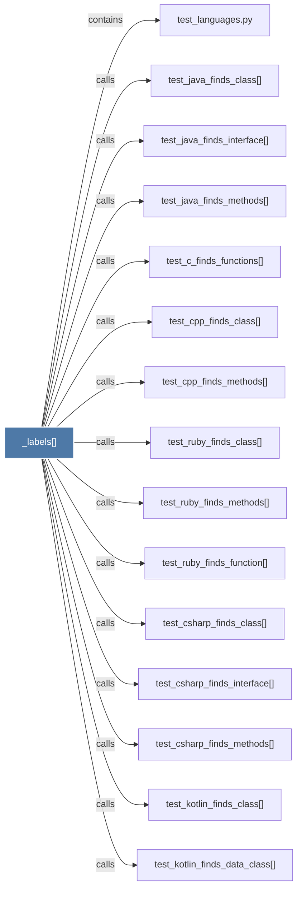

# _labels()

> [!info] Properties
> **File Type**: code
> **Community**: [[_COMMUNITY_Community None|Community None]]
> **Degree**: 34

## Architecture Graph


## Outbound Connections
- [[test_c_finds_functions()]] - `calls` [EXTRACTED]
- [[test_cpp_finds_class()]] - `calls` [EXTRACTED]
- [[test_cpp_finds_methods()]] - `calls` [EXTRACTED]
- [[test_csharp_finds_class()]] - `calls` [EXTRACTED]
- [[test_csharp_finds_interface()]] - `calls` [EXTRACTED]
- [[test_csharp_finds_methods()]] - `calls` [EXTRACTED]
- [[test_java_finds_class()]] - `calls` [EXTRACTED]
- [[test_java_finds_interface()]] - `calls` [EXTRACTED]
- [[test_java_finds_methods()]] - `calls` [EXTRACTED]
- [[test_kotlin_finds_class()]] - `calls` [EXTRACTED]
- [[test_kotlin_finds_data_class()]] - `calls` [EXTRACTED]
- [[test_kotlin_finds_function()]] - `calls` [EXTRACTED]
- [[test_kotlin_finds_methods()]] - `calls` [EXTRACTED]
- [[test_languages.py]] - `contains` [EXTRACTED]
- [[test_php_finds_class()]] - `calls` [EXTRACTED]
- [[test_php_finds_function()]] - `calls` [EXTRACTED]
- [[test_php_finds_methods()]] - `calls` [EXTRACTED]
- [[test_ruby_finds_class()]] - `calls` [EXTRACTED]
- [[test_ruby_finds_function()]] - `calls` [EXTRACTED]
- [[test_ruby_finds_methods()]] - `calls` [EXTRACTED]
- [[test_scala_finds_class()]] - `calls` [EXTRACTED]
- [[test_scala_finds_methods()]] - `calls` [EXTRACTED]
- [[test_scala_finds_object()]] - `calls` [EXTRACTED]
- [[test_swift_finds_actor()]] - `calls` [EXTRACTED]
- [[test_swift_finds_class()]] - `calls` [EXTRACTED]
- [[test_swift_finds_deinit()]] - `calls` [EXTRACTED]
- [[test_swift_finds_enum()]] - `calls` [EXTRACTED]
- [[test_swift_finds_enum_cases()]] - `calls` [EXTRACTED]
- [[test_swift_finds_enum_methods()]] - `calls` [EXTRACTED]
- [[test_swift_finds_function()]] - `calls` [EXTRACTED]
- [[test_swift_finds_methods()]] - `calls` [EXTRACTED]
- [[test_swift_finds_protocol()]] - `calls` [EXTRACTED]
- [[test_swift_finds_struct()]] - `calls` [EXTRACTED]
- [[test_swift_finds_subscript()]] - `calls` [EXTRACTED]

## Inbound Dependencies
> [!abstract]- Files that link here
```dataview
LIST
FROM [[_labels()]]
```

#graphify/code #graphify/EXTRACTED #community/Community_None