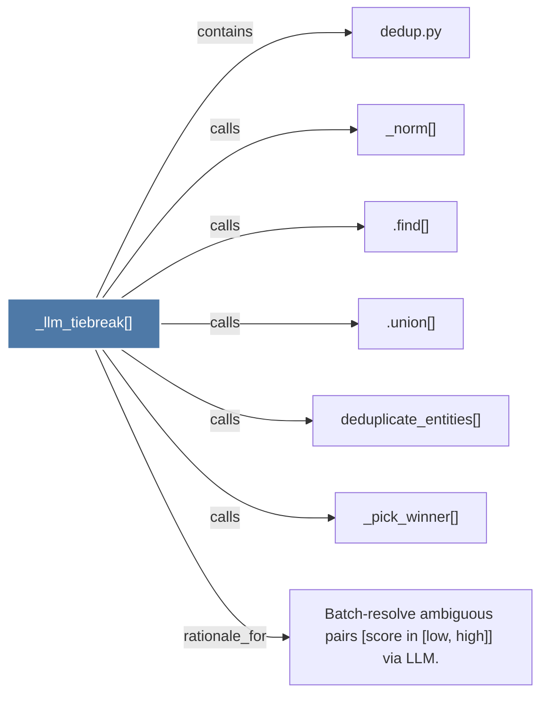

# _llm_tiebreak()

> [!info] Properties
> **File Type**: code
> **Community**: [[_COMMUNITY_Community None|Community None]]
> **Degree**: 7

## Architecture Graph


## Outbound Connections
- [[.find()]] - `calls` [EXTRACTED]
- [[.union()]] - `calls` [EXTRACTED]
- [[Batch-resolve ambiguous pairs (score in low, high)) via LLM.]] - `rationale_for` [EXTRACTED]
- [[_norm()]] - `calls` [EXTRACTED]
- [[_pick_winner()]] - `calls` [EXTRACTED]
- [[dedup.py]] - `contains` [EXTRACTED]
- [[deduplicate_entities()]] - `calls` [EXTRACTED]

## Inbound Dependencies
> [!abstract]- Files that link here
```dataview
LIST
FROM [[_llm_tiebreak()]]
```

#graphify/code #graphify/EXTRACTED #community/Community_None