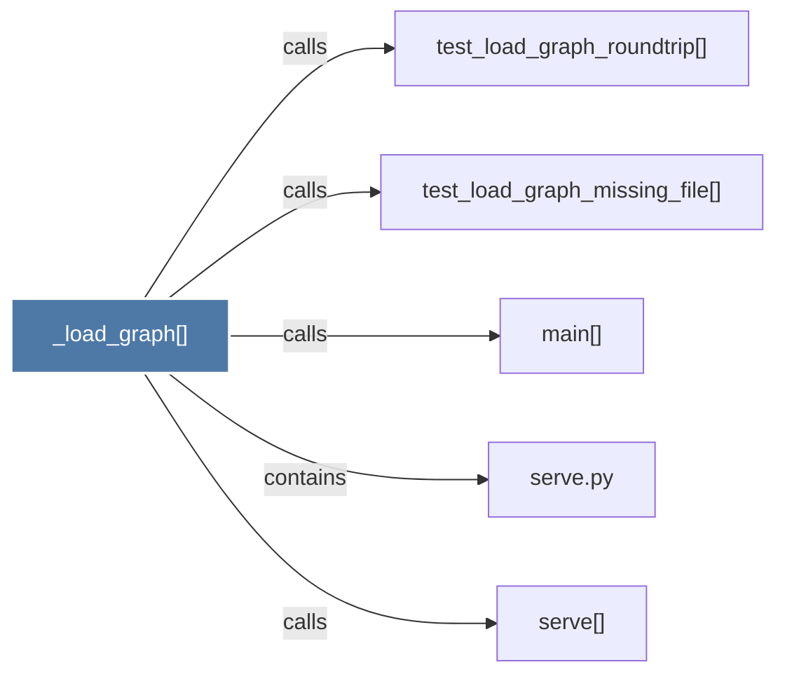

# _load_graph()

> [!info] Properties
> **File Type**: code
> **Community**: [[_COMMUNITY_Community None|Community None]]
> **Degree**: 5

## Architecture Graph


## Outbound Connections
- [[main()_2]] - `calls` [INFERRED]
- [[serve()]] - `calls` [EXTRACTED]
- [[serve.py]] - `contains` [EXTRACTED]
- [[test_load_graph_missing_file()]] - `calls` [INFERRED]
- [[test_load_graph_roundtrip()]] - `calls` [INFERRED]

## Inbound Dependencies
> [!abstract]- Files that link here
```dataview
LIST
FROM [[_load_graph()]]
```

#graphify/code #graphify/INFERRED #community/Community_None