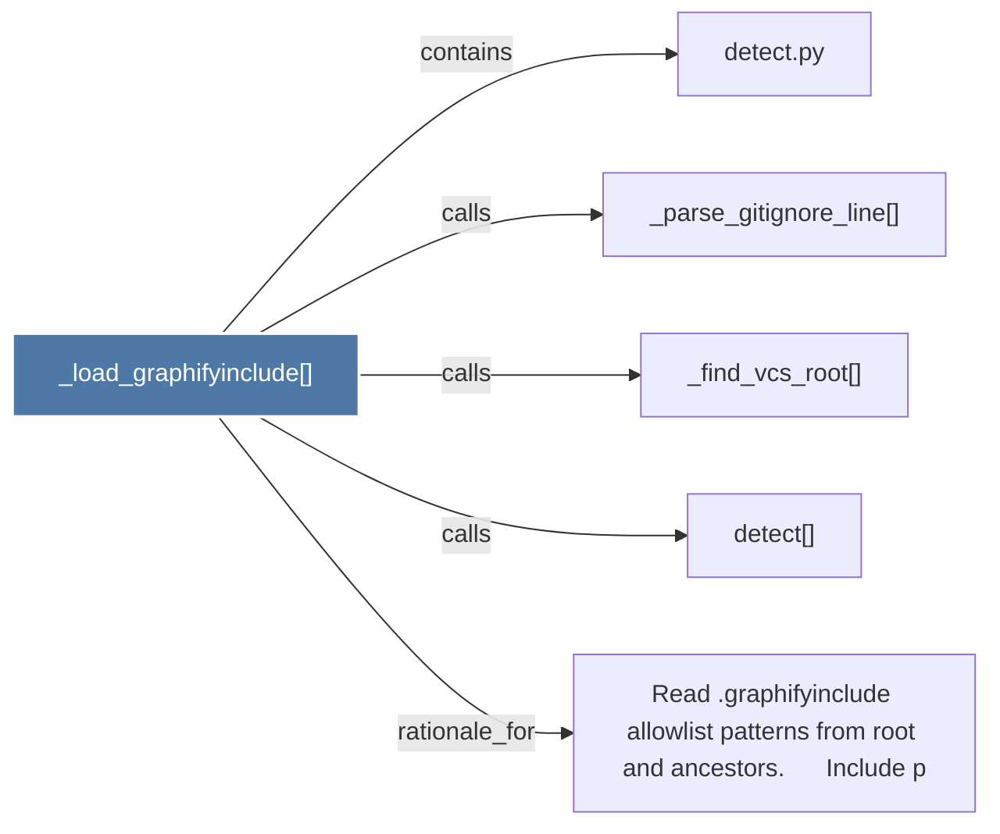

# _load_graphifyinclude()

> [!info] Properties
> **File Type**: code
> **Community**: [[_COMMUNITY_Community None|Community None]]
> **Degree**: 5

## Architecture Graph


## Outbound Connections
- [[Read .graphifyinclude allowlist patterns from root and ancestors.      Include p]] - `rationale_for` [EXTRACTED]
- [[_find_vcs_root()]] - `calls` [EXTRACTED]
- [[_parse_gitignore_line()]] - `calls` [EXTRACTED]
- [[detect()]] - `calls` [EXTRACTED]
- [[detect.py]] - `contains` [EXTRACTED]

## Inbound Dependencies
> [!abstract]- Files that link here
```dataview
LIST
FROM [[_load_graphifyinclude()]]
```

#graphify/code #graphify/EXTRACTED #community/Community_None