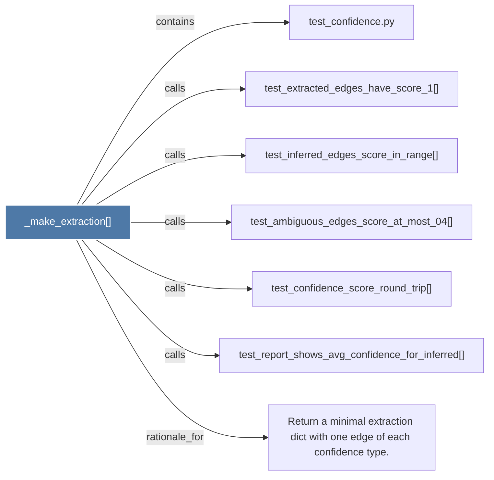

# _make_extraction()

> [!info] Properties
> **File Type**: code
> **Community**: [[_COMMUNITY_Community None|Community None]]
> **Degree**: 7

## Architecture Graph


## Outbound Connections
- [[Return a minimal extraction dict with one edge of each confidence type.]] - `rationale_for` [EXTRACTED]
- [[test_ambiguous_edges_score_at_most_04()]] - `calls` [EXTRACTED]
- [[test_confidence.py]] - `contains` [EXTRACTED]
- [[test_confidence_score_round_trip()]] - `calls` [EXTRACTED]
- [[test_extracted_edges_have_score_1()]] - `calls` [EXTRACTED]
- [[test_inferred_edges_score_in_range()]] - `calls` [EXTRACTED]
- [[test_report_shows_avg_confidence_for_inferred()]] - `calls` [EXTRACTED]

## Inbound Dependencies
> [!abstract]- Files that link here
```dataview
LIST
FROM [[_make_extraction()]]
```

#graphify/code #graphify/EXTRACTED #community/Community_None