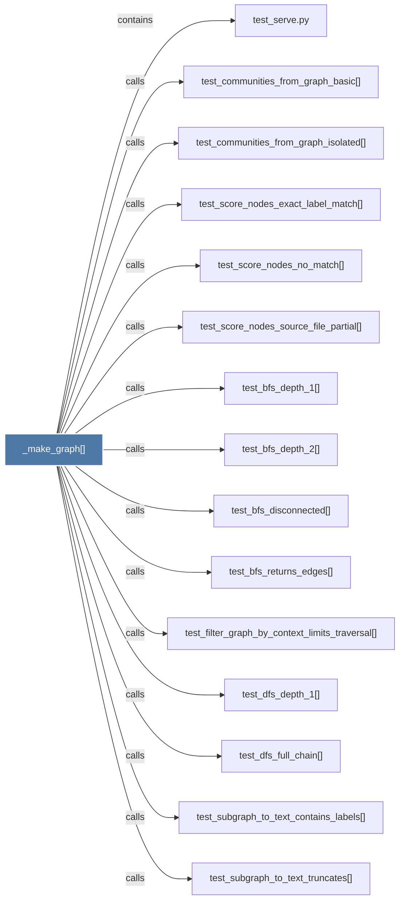

# _make_graph()

> [!info] Properties
> **File Type**: code
> **Community**: [[_COMMUNITY_Community None|Community None]]
> **Degree**: 20

## Architecture Graph


## Outbound Connections
- [[test_bfs_depth_1()]] - `calls` [EXTRACTED]
- [[test_bfs_depth_2()]] - `calls` [EXTRACTED]
- [[test_bfs_disconnected()]] - `calls` [EXTRACTED]
- [[test_bfs_returns_edges()]] - `calls` [EXTRACTED]
- [[test_communities_from_graph_basic()]] - `calls` [EXTRACTED]
- [[test_communities_from_graph_isolated()]] - `calls` [EXTRACTED]
- [[test_dfs_depth_1()]] - `calls` [EXTRACTED]
- [[test_dfs_full_chain()]] - `calls` [EXTRACTED]
- [[test_filter_graph_by_context_limits_traversal()]] - `calls` [EXTRACTED]
- [[test_load_graph_roundtrip()]] - `calls` [EXTRACTED]
- [[test_query_graph_text_explicit_context_filter_changes_traversal()]] - `calls` [EXTRACTED]
- [[test_query_graph_text_heuristic_context_filter_changes_traversal()]] - `calls` [EXTRACTED]
- [[test_score_nodes_exact_label_match()]] - `calls` [EXTRACTED]
- [[test_score_nodes_no_match()]] - `calls` [EXTRACTED]
- [[test_score_nodes_source_file_partial()]] - `calls` [EXTRACTED]
- [[test_serve.py]] - `contains` [EXTRACTED]
- [[test_subgraph_to_text_contains_labels()]] - `calls` [EXTRACTED]
- [[test_subgraph_to_text_edge_included()]] - `calls` [EXTRACTED]
- [[test_subgraph_to_text_includes_edge_context()]] - `calls` [EXTRACTED]
- [[test_subgraph_to_text_truncates()]] - `calls` [EXTRACTED]

## Inbound Dependencies
> [!abstract]- Files that link here
```dataview
LIST
FROM [[_make_graph()_1]]
```

#graphify/code #graphify/EXTRACTED #community/Community_None