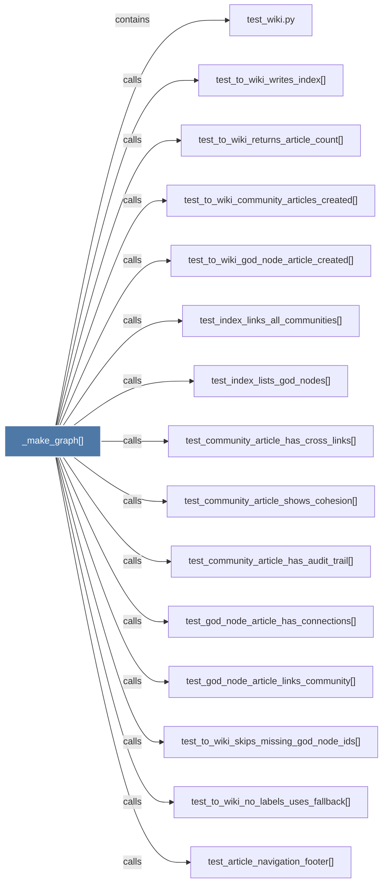

# _make_graph()

> [!info] Properties
> **File Type**: code
> **Community**: [[_COMMUNITY_Community None|Community None]]
> **Degree**: 15

## Architecture Graph


## Outbound Connections
- [[test_article_navigation_footer()]] - `calls` [EXTRACTED]
- [[test_community_article_has_audit_trail()]] - `calls` [EXTRACTED]
- [[test_community_article_has_cross_links()]] - `calls` [EXTRACTED]
- [[test_community_article_shows_cohesion()]] - `calls` [EXTRACTED]
- [[test_god_node_article_has_connections()]] - `calls` [EXTRACTED]
- [[test_god_node_article_links_community()]] - `calls` [EXTRACTED]
- [[test_index_links_all_communities()]] - `calls` [EXTRACTED]
- [[test_index_lists_god_nodes()]] - `calls` [EXTRACTED]
- [[test_to_wiki_community_articles_created()]] - `calls` [EXTRACTED]
- [[test_to_wiki_god_node_article_created()]] - `calls` [EXTRACTED]
- [[test_to_wiki_no_labels_uses_fallback()]] - `calls` [EXTRACTED]
- [[test_to_wiki_returns_article_count()]] - `calls` [EXTRACTED]
- [[test_to_wiki_skips_missing_god_node_ids()]] - `calls` [EXTRACTED]
- [[test_to_wiki_writes_index()]] - `calls` [EXTRACTED]
- [[test_wiki.py]] - `contains` [EXTRACTED]

## Inbound Dependencies
> [!abstract]- Files that link here
```dataview
LIST
FROM [[_make_graph()_2]]
```

#graphify/code #graphify/EXTRACTED #community/Community_None