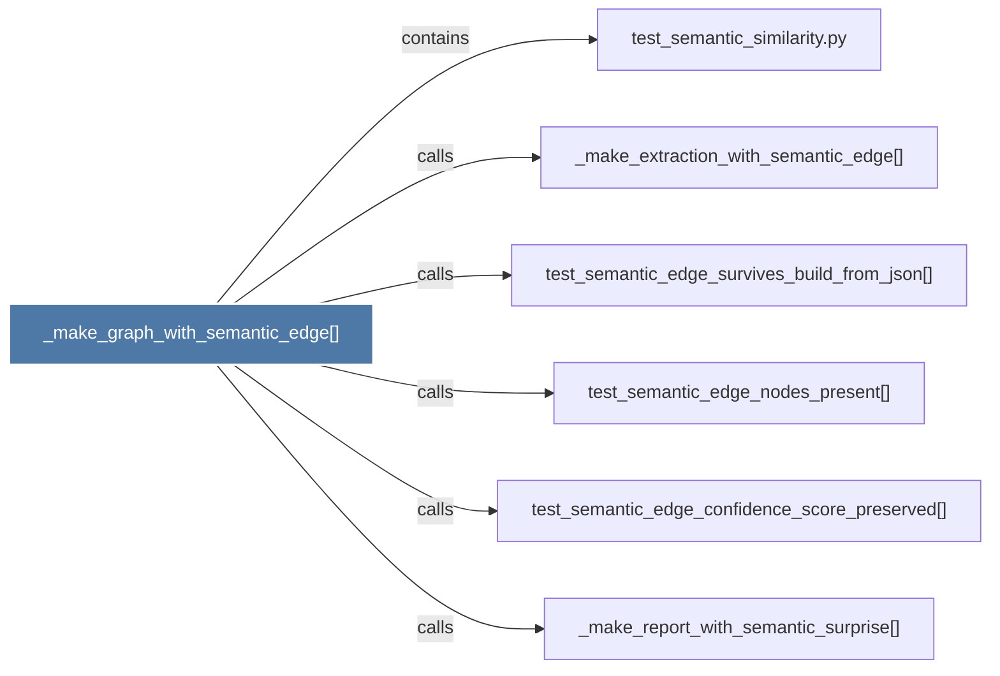

# _make_graph_with_semantic_edge()

> [!info] Properties
> **File Type**: code
> **Community**: [[_COMMUNITY_Community None|Community None]]
> **Degree**: 6

## Architecture Graph


## Outbound Connections
- [[_make_extraction_with_semantic_edge()]] - `calls` [EXTRACTED]
- [[_make_report_with_semantic_surprise()]] - `calls` [EXTRACTED]
- [[test_semantic_edge_confidence_score_preserved()]] - `calls` [EXTRACTED]
- [[test_semantic_edge_nodes_present()]] - `calls` [EXTRACTED]
- [[test_semantic_edge_survives_build_from_json()]] - `calls` [EXTRACTED]
- [[test_semantic_similarity.py]] - `contains` [EXTRACTED]

## Inbound Dependencies
> [!abstract]- Files that link here
```dataview
LIST
FROM [[_make_graph_with_semantic_edge()]]
```

#graphify/code #graphify/EXTRACTED #community/Community_None