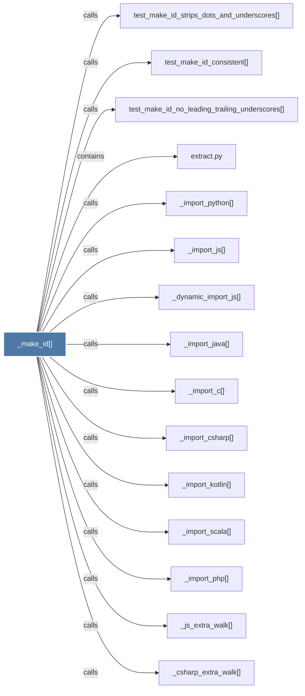

# _make_id()

> [!info] Properties
> **File Type**: code
> **Community**: [[_COMMUNITY_Community None|Community None]]
> **Degree**: 36

## Architecture Graph


## Outbound Connections
- [[Build a stable node ID from one or more name parts.]] - `rationale_for` [EXTRACTED]
- [[_csharp_extra_walk()]] - `calls` [EXTRACTED]
- [[_dynamic_import_js()]] - `calls` [EXTRACTED]
- [[_extract_generic()]] - `calls` [EXTRACTED]
- [[_extract_python_rationale()]] - `calls` [EXTRACTED]
- [[_import_c()]] - `calls` [EXTRACTED]
- [[_import_csharp()]] - `calls` [EXTRACTED]
- [[_import_java()]] - `calls` [EXTRACTED]
- [[_import_js()]] - `calls` [EXTRACTED]
- [[_import_kotlin()]] - `calls` [EXTRACTED]
- [[_import_php()]] - `calls` [EXTRACTED]
- [[_import_python()]] - `calls` [EXTRACTED]
- [[_import_scala()]] - `calls` [EXTRACTED]
- [[_import_swift()]] - `calls` [EXTRACTED]
- [[_js_extra_walk()]] - `calls` [EXTRACTED]
- [[_resolve_cross_file_imports()]] - `calls` [EXTRACTED]
- [[_resolve_cross_file_java_imports()]] - `calls` [EXTRACTED]
- [[_swift_extra_walk()]] - `calls` [EXTRACTED]
- [[extract()]] - `calls` [EXTRACTED]
- [[extract.py]] - `contains` [EXTRACTED]
- [[extract_blade()]] - `calls` [EXTRACTED]
- [[extract_dart()]] - `calls` [EXTRACTED]
- [[extract_elixir()]] - `calls` [EXTRACTED]
- [[extract_fortran()]] - `calls` [EXTRACTED]
- [[extract_go()]] - `calls` [EXTRACTED]
- [[extract_julia()]] - `calls` [EXTRACTED]
- [[extract_objc()]] - `calls` [EXTRACTED]
- [[extract_powershell()]] - `calls` [EXTRACTED]
- [[extract_rust()]] - `calls` [EXTRACTED]
- [[extract_sql()]] - `calls` [EXTRACTED]
- [[extract_svelte()]] - `calls` [EXTRACTED]
- [[extract_verilog()]] - `calls` [EXTRACTED]
- [[extract_zig()]] - `calls` [EXTRACTED]
- [[test_make_id_consistent()]] - `calls` [INFERRED]
- [[test_make_id_no_leading_trailing_underscores()]] - `calls` [INFERRED]
- [[test_make_id_strips_dots_and_underscores()]] - `calls` [INFERRED]

## Inbound Dependencies
> [!abstract]- Files that link here
```dataview
LIST
FROM [[_make_id()]]
```

#graphify/code #graphify/EXTRACTED #community/Community_None