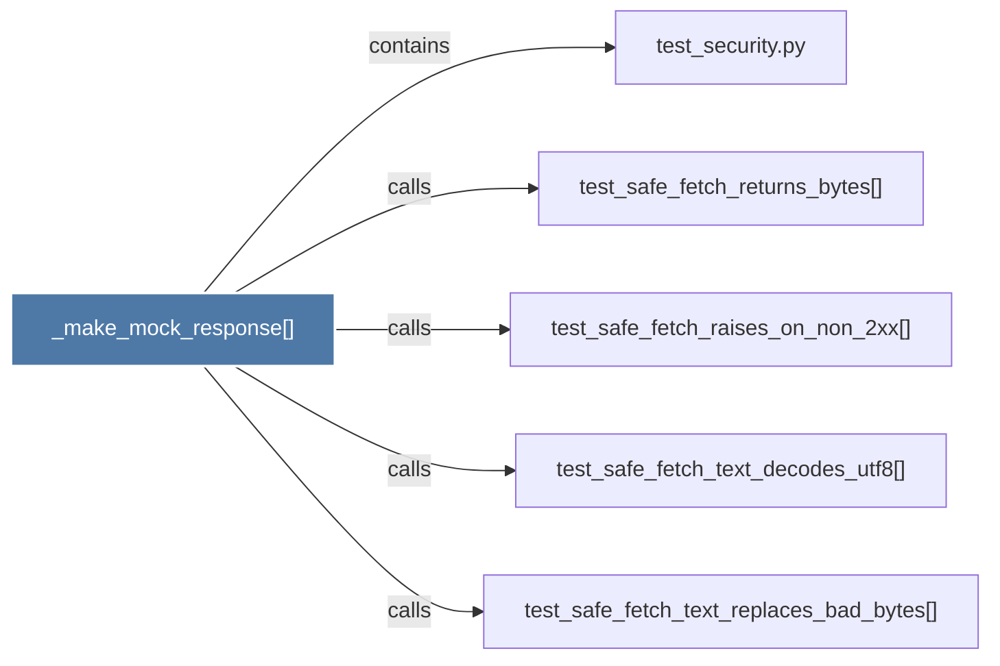

# _make_mock_response()

> [!info] Properties
> **File Type**: code
> **Community**: [[_COMMUNITY_Community None|Community None]]
> **Degree**: 5

## Architecture Graph


## Outbound Connections
- [[test_safe_fetch_raises_on_non_2xx()]] - `calls` [EXTRACTED]
- [[test_safe_fetch_returns_bytes()]] - `calls` [EXTRACTED]
- [[test_safe_fetch_text_decodes_utf8()]] - `calls` [EXTRACTED]
- [[test_safe_fetch_text_replaces_bad_bytes()]] - `calls` [EXTRACTED]
- [[test_security.py]] - `contains` [EXTRACTED]

## Inbound Dependencies
> [!abstract]- Files that link here
```dataview
LIST
FROM [[_make_mock_response()]]
```

#graphify/code #graphify/EXTRACTED #community/Community_None